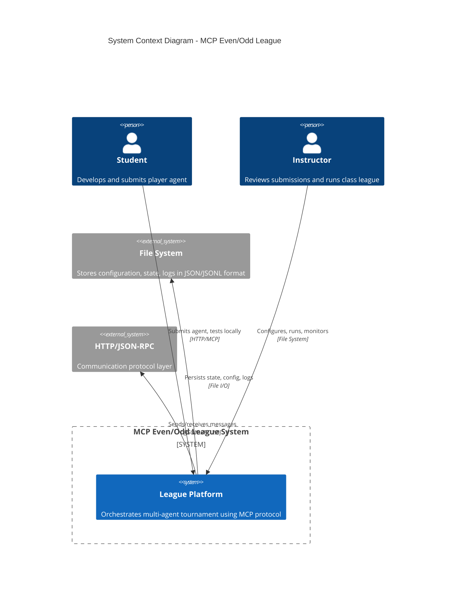
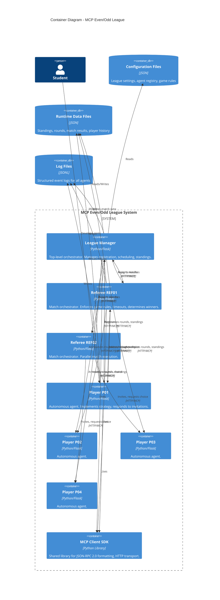
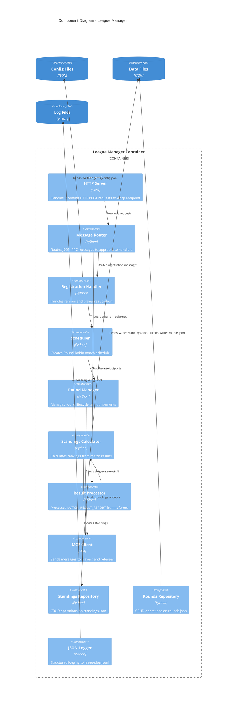
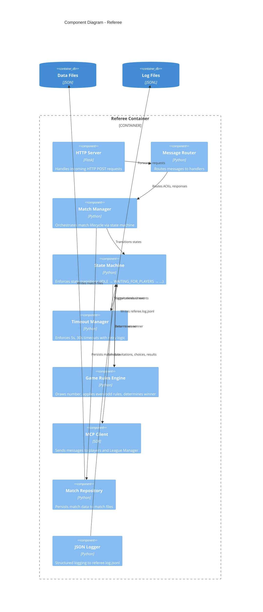
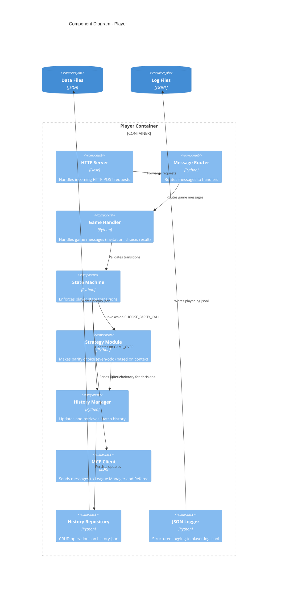
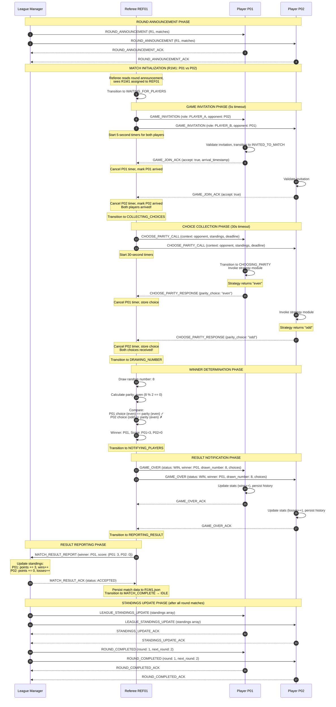
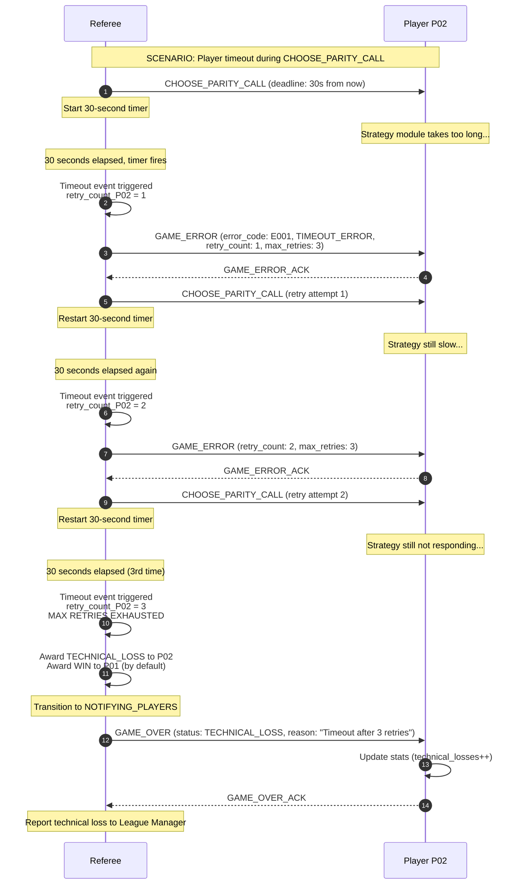
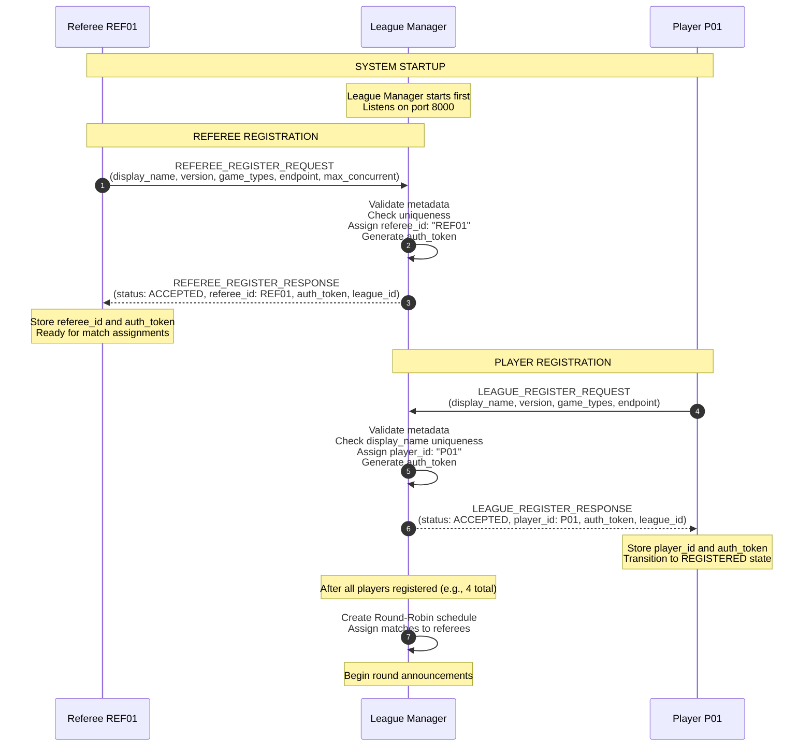
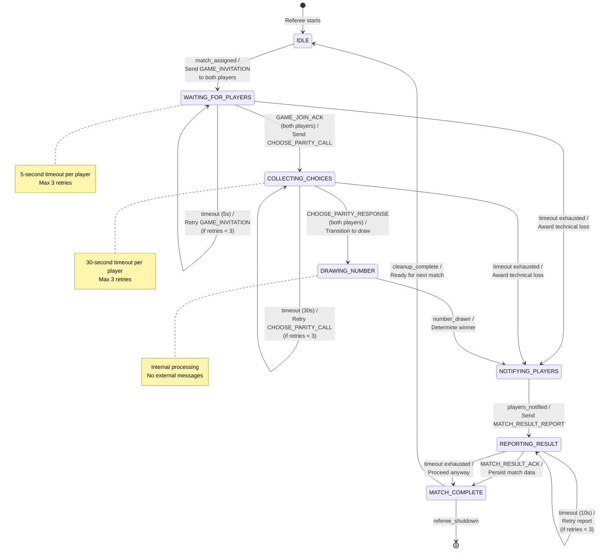
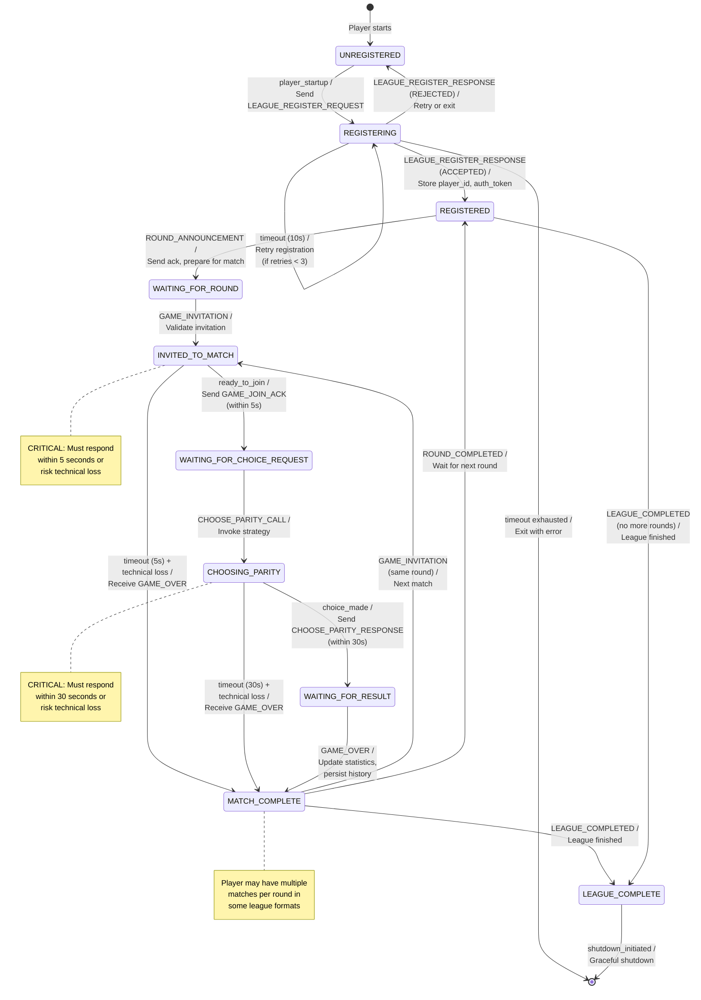

# Architecture Documentation
## MCP Even/Odd League System

**Document Version:** 1.0
**Last Updated:** 2025-01-20
**Protocol Version:** league.v2
**Status:** Active Development

---

## Table of Contents

1. [Overview](#1-overview)
2. [C4 Model](#2-c4-model)
3. [Sequence Diagrams](#3-sequence-diagrams)
4. [State Machines](#4-state-machines)
5. [Architecture Decision Records](#5-architecture-decision-records)
6. [Component Details](#6-component-details)
7. [Data Architecture](#7-data-architecture)
8. [Cross-Cutting Concerns](#8-cross-cutting-concerns)
9. [References](#9-references)

---

## 1. Overview

### 1.1 System Purpose

The MCP Even/Odd League is a distributed multi-agent system designed to demonstrate Model Context Protocol (MCP) implementation in a tournament setting. The system orchestrates autonomous player agents competing in an even/odd guessing game through a round-robin format.

**Key Characteristics:**
- **Distributed**: Agents run in separate processes communicating over HTTP
- **Protocol-First**: All communication follows JSON-RPC 2.0 / MCP standards
- **Autonomous**: Each player implements independent strategy
- **Orchestrated**: League Manager and Referees coordinate without centralized control of game logic

### 1.2 Architectural Style

**Primary Style:** Event-Driven Microservices Architecture

- **Microservices**: Each agent (League Manager, Referee, Player) is an independent HTTP service
- **Event-Driven**: State transitions triggered by message events
- **Asynchronous**: Non-blocking communication with timeout enforcement
- **State Machine-Based**: Agents follow formal state machines for predictable behavior

**Supporting Patterns:**
- Protocol-based communication (MCP over JSON-RPC 2.0)
- Repository pattern for data persistence
- Strategy pattern for player decision-making
- Observer pattern for league coordination (standings updates, round notifications)

### 1.3 Quality Attributes

Per `docs/PRD.md` Section 5 (Non-Functional Requirements):

**Performance:**
- Response time: < 5s for GAME_JOIN_ACK, < 30s for CHOOSE_PARITY_RESPONSE
- Throughput: 6-match league completion in < 5 minutes

**Reliability:**
- 99.9% uptime for League Manager
- Graceful handling of player crashes (technical loss)
- Fault isolation (one player crash doesn't affect others)

**Scalability:**
- Support 2-10,000 players per league
- Horizontal scaling via multiple referee instances
- File-based persistence (no database required)

**Maintainability:**
- Modular design with clear interfaces
- Protocol versioning for evolution
- Comprehensive logging for debugging

---

## 2. C4 Model

The C4 model provides architectural views at different levels of abstraction.

### 2.1 Level 1: System Context Diagram



**Context Description:**

**Actors:**
- **Student**: Develops player agent, tests locally with 4 agents, submits for class league
- **Instructor**: Configures league parameters, runs class league, reviews results

**System:** MCP Even/Odd League Platform
- Manages tournament lifecycle (registration → rounds → completion)
- Enforces game rules and protocol compliance
- Maintains standings and match history

**External Systems:**
- **File System**: Persistent storage for all configuration, runtime state, and logs
- **HTTP/JSON-RPC**: Communication transport layer (agents communicate via localhost HTTP)

---

### 2.2 Level 2: Container Diagram



**Container Descriptions:**

| Container | Technology | Port | Responsibilities |
|-----------|-----------|------|------------------|
| **League Manager** | Python/Flask | 8000 | Registration, scheduling, standings, league lifecycle |
| **Referee REF01** | Python/Flask | 8001 | Match orchestration, timeout enforcement, winner determination |
| **Referee REF02** | Python/Flask | 8002 | Parallel match execution |
| **Player P01-P04** | Python/Flask | 8101-8104 | Game participation, strategy execution, history tracking |
| **MCP Client SDK** | Python Library | N/A | Protocol formatting, HTTP transport, timeout handling |
| **Configuration Files** | JSON | File System | Static configuration (league settings, agent registry) |
| **Runtime Data** | JSON | File System | Dynamic state (standings, rounds, match results, player history) |
| **Log Files** | JSONL | File System | Event logs for debugging and audit |

**Communication Patterns:**

- **League Manager → Players**: Broadcasts (round announcements, standings updates)
- **League Manager → Referees**: Implicit (via round announcements, referees self-assign from schedule)
- **Referee → Players**: Point-to-point (invitations, choice requests, results)
- **Referee → League Manager**: Point-to-point (result reports)
- **Players → League Manager**: Point-to-point (registration, queries)
- **Players → Referees**: Point-to-point (acknowledgments, choices)

---

### 2.3 Level 3: Component Diagram - League Manager



**Component Responsibilities:**

**HTTP Server (Flask)**
- Listens on port 8000
- Exposes `/mcp` endpoint
- Validates JSON-RPC 2.0 format
- Returns responses to callers

**Message Router**
- Parses `message_type` field
- Dispatches to appropriate handler
- Handles unknown message types

**Registration Handler**
- Validates referee/player metadata
- Assigns unique IDs (REF01, P01, P02, ...)
- Generates authentication tokens
- Stores in agents_config.json
- Triggers scheduler when threshold reached

**Scheduler**
- Implements Round-Robin algorithm
- Assigns matches to available referees (load balancing)
- Generates match IDs (R1M1, R1M2, ...)
- Persists schedule to rounds.json

**Round Manager**
- Broadcasts ROUND_ANNOUNCEMENT to all players
- Tracks round progress (matches completed)
- Sends ROUND_COMPLETED when all matches done
- Triggers next round or league completion

**Standings Calculator**
- Applies scoring rules (win=3, draw=1, loss=0)
- Sorts by points (desc), then wins (desc), then alphabetically
- Assigns ranks (1, 2, 3, ...)
- Detects champion (highest points at end)

**Result Processor**
- Validates MATCH_RESULT_REPORT from referees
- Checks auth_token
- Prevents duplicate reports
- Forwards to standings calculator

**MCP Client**
- Formats messages with protocol fields
- Sends HTTP POST requests
- Enforces 10-second timeout for acknowledgments
- Handles retries for transient failures

**Repositories**
- Encapsulate file I/O
- Validate JSON schema
- Handle concurrent access (file locking)
- Maintain data versioning

**JSON Logger**
- Writes structured logs (JSONL format)
- Includes timestamp, component, event_type, level, details
- Supports log levels: INFO, WARNING, ERROR

---

### 2.4 Level 3: Component Diagram - Referee



**Component Responsibilities:**

**Match Manager**
- Receives match assignment from round announcement
- Initializes match context (players, match_id)
- Coordinates state machine execution
- Persists final match data

**State Machine** (See Section 4.2 for full specification)
- Enforces legal state transitions
- Validates preconditions for transitions
- Executes transition actions
- Handles illegal transitions

**Timeout Manager**
- Starts timers on state entry (5s for GAME_JOIN_ACK, 30s for CHOOSE_PARITY_RESPONSE)
- Cancels timers on successful response
- Triggers timeout events when timer expires
- Manages retry counters (max 3 retries)

**Game Rules Engine**
- Draws random number from 1-10 (uniform distribution)
- Calculates parity (even if num % 2 == 0, else odd)
- Compares player choices to parity
- Determines winner:
  - Both correct OR both wrong → DRAW
  - One correct → Winner
- Calculates scores (win=3, loss=0, draw=1 each)

---

### 2.5 Level 3: Component Diagram - Player



**Component Responsibilities:**

**Game Handler**
- Implements MCP tool methods:
  - `handle_game_invitation` → returns GAME_JOIN_ACK
  - `parity_choose` → returns CHOOSE_PARITY_RESPONSE
  - `notify_match_result` → updates history
- Validates incoming messages
- Coordinates with state machine

**State Machine** (See Section 4.3 for full specification)
- Tracks player state (UNREGISTERED → REGISTERED → WAITING_FOR_ROUND → ...)
- Validates state transitions
- Enforces critical timeouts (5s, 30s)
- Protects against illegal transitions

**Strategy Module**
- Receives context (opponent, standings, round)
- Queries history for opponent patterns (optional)
- Makes parity choice ("even" or "odd")
- Must complete within 30 seconds (enforced by player)
- **Implementation varies by student** (simple random, pattern-based, ML)

**History Manager**
- Stores match results (match_id, opponent, result, choices, drawn_number)
- Updates statistics (wins, losses, draws, points)
- Provides query interface for strategy
- Persists to history.json after each match

---

## 3. Sequence Diagrams

### 3.1 Complete Match Lifecycle Sequence



**Sequence Description:**

**Phase 1: Round Announcement (Steps 1-4)**
- League Manager broadcasts round details to all players
- Players store match context and prepare for invitations

**Phase 2: Match Initialization (Steps 5-6)**
- Referee receives round announcement (not shown in diagram - implicit)
- Referee identifies matches assigned to it (R1M1 in this case)
- Referee transitions state to WAITING_FOR_PLAYERS

**Phase 3: Game Invitation (Steps 7-14)**
- Referee sends GAME_INVITATION to both players
- **Critical 5-second timeout** starts
- Players must respond with GAME_JOIN_ACK within 5 seconds
- Referee waits for both players to arrive
- On success, transitions to COLLECTING_CHOICES

**Phase 4: Choice Collection (Steps 15-24)**
- Referee sends CHOOSE_PARITY_CALL to both players
- **Critical 30-second timeout** starts
- Players invoke strategy modules to decide parity
- Players respond with CHOOSE_PARITY_RESPONSE
- Referee stores both choices

**Phase 5: Winner Determination (Steps 25-30)**
- Referee draws random number (1-10)
- Referee calculates parity of drawn number
- Referee compares player choices to number parity
- Referee determines winner and calculates scores

**Phase 6: Result Notification (Steps 31-36)**
- Referee sends GAME_OVER to both players
- Players update internal statistics and history
- Players acknowledge receipt (10-second timeout, best effort)

**Phase 7: Result Reporting (Steps 37-40)**
- Referee sends MATCH_RESULT_REPORT to League Manager
- League Manager updates standings table
- League Manager acknowledges receipt
- Referee persists match data and returns to IDLE

**Phase 8: Standings Update (Steps 41-48)**
- After all matches in round complete, League Manager sends standings updates
- League Manager sends ROUND_COMPLETED notification
- Players prepare for next round or league completion

---

### 3.2 Timeout and Retry Sequence



**Timeout Handling Rules:**

1. **Initial Timeout**: Start timer when sending request
2. **Timeout Event**: After timeout expires, increment retry counter
3. **Send Error**: Notify player with GAME_ERROR
4. **Retry**: Resend original request
5. **Check Limit**: If retry_count < max_retries (3), repeat steps 1-4
6. **Exhaust Retries**: After 3 failed attempts, award technical loss
7. **Continue Match**: Proceed with match completion using default winner

**Applicable Messages:**
- GAME_JOIN_ACK: 5-second timeout, max 3 retries
- CHOOSE_PARITY_RESPONSE: 30-second timeout, max 3 retries

---

### 3.3 Registration Sequence



---

## 4. State Machines

This section references the comprehensive state machine specifications from `docs/architecture/state_machines.md`.

### 4.1 State Machine Overview

**Purpose:** Ensure predictable, verifiable agent behavior through formal state transitions.

**Benefits:**
- **Correctness**: Illegal transitions prevented at runtime
- **Debugging**: State transitions logged for tracing
- **Testing**: Each transition independently testable
- **Documentation**: State machines serve as implementation specification

### 4.2 Referee State Machine

**Full Specification:** See `docs/architecture/state_machines.md` Section 2

**States (7 total):**
1. IDLE - Waiting for match assignment
2. WAITING_FOR_PLAYERS - Sent invitations, waiting for GAME_JOIN_ACK (5s timeout)
3. COLLECTING_CHOICES - Both players joined, waiting for CHOOSE_PARITY_RESPONSE (30s timeout)
4. DRAWING_NUMBER - Internal processing (draws number, determines winner)
5. NOTIFYING_PLAYERS - Sending GAME_OVER to both players
6. REPORTING_RESULT - Sending MATCH_RESULT_REPORT to League Manager
7. MATCH_COMPLETE - Match finished, ready for next match

**State Diagram:**



**Critical Transitions:**

| From State | Event | To State | Timeout | Retry |
|------------|-------|----------|---------|-------|
| WAITING_FOR_PLAYERS | GAME_JOIN_ACK (both) | COLLECTING_CHOICES | 5s | Max 3 |
| COLLECTING_CHOICES | CHOOSE_PARITY_RESPONSE (both) | DRAWING_NUMBER | 30s | Max 3 |
| DRAWING_NUMBER | number_drawn | NOTIFYING_PLAYERS | None | N/A |
| REPORTING_RESULT | MATCH_RESULT_ACK | MATCH_COMPLETE | 10s | Max 3 |

**For complete transition table with preconditions, actions, and error handling:** See `docs/architecture/state_machines.md` Section 2.3

---

### 4.3 Player State Machine

**Full Specification:** See `docs/architecture/state_machines.md` Section 3

**States (10 total):**
1. UNREGISTERED - Initial state
2. REGISTERING - Registration request sent
3. REGISTERED - Successfully registered, waiting for round announcement
4. WAITING_FOR_ROUND - Received round announcement, waiting for invitation
5. INVITED_TO_MATCH - Received invitation, must send GAME_JOIN_ACK within 5s
6. WAITING_FOR_CHOICE_REQUEST - Sent GAME_JOIN_ACK, waiting for CHOOSE_PARITY_CALL
7. CHOOSING_PARITY - Received choice request, must respond within 30s
8. WAITING_FOR_RESULT - Sent choice, waiting for GAME_OVER
9. MATCH_COMPLETE - Received result, match finished
10. LEAGUE_COMPLETE - League finished

**State Diagram:**



**Critical Transitions:**

| From State | Event | To State | Player Timeout | Consequence |
|------------|-------|----------|----------------|-------------|
| INVITED_TO_MATCH | ready_to_join | WAITING_FOR_CHOICE_REQUEST | Must send ACK in 5s | Technical loss if late |
| CHOOSING_PARITY | choice_made | WAITING_FOR_RESULT | Must send choice in 30s | Technical loss if late |

**For complete transition table:** See `docs/architecture/state_machines.md` Section 3.3

---

### 4.4 League Manager State Machine

**Note:** League Manager state machine is simpler and not fully documented in state_machines.md. High-level states:

1. **WAITING_FOR_REGISTRATIONS** - Accepting referee and player registrations
2. **CREATING_SCHEDULE** - All players registered, creating Round-Robin schedule
3. **RUNNING_LEAGUE** - Active league, managing rounds
4. **LEAGUE_COMPLETE** - All rounds finished, champion declared

**Transitions:**
- Registration threshold reached → Trigger schedule creation
- All matches in round complete → Send standings update, announce round complete
- All rounds complete → Send LEAGUE_COMPLETED

---

## 5. Architecture Decision Records

This section documents key architectural decisions, their context, alternatives considered, and rationale.

### ADR-001: Use JSON-RPC 2.0 over HTTP for Agent Communication

**Status:** Accepted

**Context:**
- Need standardized protocol for multi-agent communication
- Agents may be implemented in different languages (Python, Java, JavaScript)
- System requires request-response pattern with timeouts
- Must support asynchronous, non-blocking communication

**Decision:**
Use JSON-RPC 2.0 transported over HTTP POST to `/mcp` endpoint.

**Alternatives Considered:**

1. **gRPC**
   - Pros: Type safety, bi-directional streaming, better performance
   - Cons: Requires protobuf schema, more complex setup, overkill for educational project
   - Rejected: Too complex for assignment scope

2. **WebSockets**
   - Pros: Bi-directional, real-time, persistent connections
   - Cons: Complexity of connection management, not request-response naturally
   - Rejected: Request-response pattern sufficient

3. **REST with custom JSON**
   - Pros: Simple, widely understood
   - Cons: No standard error format, no standard envelope, would reinvent JSON-RPC
   - Rejected: JSON-RPC provides these standardizations

4. **Message Queue (RabbitMQ, Kafka)**
   - Pros: Decoupling, guaranteed delivery, scalability
   - Cons: Infrastructure overhead, complexity, not needed for localhost
   - Rejected: Over-engineering for educational scope

**Rationale:**
- JSON-RPC 2.0 is lightweight and well-defined (RFC 4627)
- HTTP is universally supported across languages
- Request-response pattern maps naturally to game flow
- Timeouts easily implemented at HTTP client level
- JSON is human-readable for debugging
- No infrastructure dependencies (no broker, no service mesh)

**Consequences:**
- (+) Simple implementation for students
- (+) Language-agnostic (students can use any language)
- (+) Easy debugging (can inspect with curl, Postman)
- (+) Timeout enforcement straightforward
- (-) No built-in retry or delivery guarantees (must implement in application layer)
- (-) No persistent connections (overhead of HTTP handshake per message, acceptable for localhost)

**Implementation:**
- All messages wrapped in JSON-RPC 2.0 envelope (jsonrpc, method, params, id)
- MCP protocol fields nested in params object
- Standard error response format for all errors

---

### ADR-002: Use File-Based JSON Storage Instead of Database

**Status:** Accepted

**Context:**
- Need to persist configuration, runtime state, and logs
- System designed for 2-10,000 players (moderate scale)
- Educational project, not production deployment
- Students need easy access to data for debugging and analysis

**Decision:**
Use JSON files for configuration and runtime data, JSONL for logs. No database.

**Alternatives Considered:**

1. **SQLite Database**
   - Pros: ACID transactions, SQL queries, relational model
   - Cons: Additional dependency, schema migrations, less human-readable
   - Rejected: Overkill for scope, harder for students to inspect

2. **NoSQL Database (MongoDB, Redis)**
   - Pros: Flexible schema, scalability
   - Cons: Infrastructure requirement, deployment complexity
   - Rejected: Over-engineering, no deployment

3. **In-Memory Only (No Persistence)**
   - Pros: Fastest, simplest
   - Cons: Data loss on crash, can't audit history
   - Rejected: Need persistence for debugging and auditing

4. **CSV Files**
   - Pros: Simple, human-readable
   - Cons: No nested structures, harder to parse complex data
   - Rejected: Game results and standings have nested structures

**Rationale:**
- JSON is human-readable and editable (useful for debugging)
- No installation or setup required (just file system)
- Works across all platforms (macOS, Linux, Windows)
- Students can easily inspect state with text editor or `cat` command
- JSONL (JSON Lines) perfect for append-only logs
- Sufficient performance for target scale (< 10,000 players)
- Python's `json` module is built-in (no dependencies)

**Consequences:**
- (+) Zero infrastructure setup
- (+) Easy debugging (students can read files directly)
- (+) Simple implementation (just file I/O)
- (+) Cross-platform compatibility
- (-) No ACID transactions (must implement file locking)
- (-) No complex queries (must load and filter in memory)
- (-) No automatic indexing (sequential search)
- (-) Scalability limited (10,000+ players would require optimization)

**Implementation:**
- `/config` directory: Static configuration files (JSON)
- `/data` directory: Runtime state files (JSON)
- `/logs` directory: Event logs (JSONL)
- Schema versioning via `schema_version` field in all files
- File locking for concurrent writes (if needed)

---

### ADR-003: Implement Formal State Machines for Agent Behavior

**Status:** Accepted

**Context:**
- Agents must follow complex protocols with many states and transitions
- Need to prevent illegal transitions (e.g., player choosing parity before joining match)
- Debugging distributed system requires traceability
- Students need clear specification to implement correctly

**Decision:**
Implement explicit state machines for Referee (7 states) and Player (10 states) with formal transition tables.

**Alternatives Considered:**

1. **Implicit State (Flag-Based)**
   - Example: `player_joined`, `choice_received` booleans
   - Pros: Simple, flexible
   - Cons: Hard to verify correctness, easy to miss edge cases
   - Rejected: Too error-prone for educational project

2. **Stateless Event Handlers**
   - Example: Each message handler is independent, no state tracking
   - Pros: Simplest implementation
   - Cons: Can't enforce ordering (e.g., must join before choosing)
   - Rejected: Protocol requires state

3. **Actor Model (Akka, Orleans)**
   - Pros: Built-in state management, message passing
   - Cons: Framework dependency, learning curve
   - Rejected: Over-engineering for assignment

4. **Process Algebra (CSP, π-calculus)**
   - Pros: Formal verification possible
   - Cons: High complexity, specialized knowledge required
   - Rejected: Too academic, not practical for students

**Rationale:**
- State machines provide **clear specification** for implementation
- **Illegal transitions** can be detected and rejected at runtime
- **Logging** state transitions enables debugging (trace exact path through system)
- **Testability**: Each transition can be unit tested independently
- **Documentation**: State diagram serves as both spec and documentation
- **Predictability**: System behavior is deterministic and verifiable

**Consequences:**
- (+) Clear specification for students to follow
- (+) Easier debugging (state transitions logged)
- (+) Prevented illegal transitions improve correctness
- (+) State diagrams serve as documentation
- (+) Each transition independently testable
- (-) More code (state enum, transition validation)
- (-) Requires discipline to update state machine when protocol changes

**Implementation:**
- State enum for each agent type
- Explicit state field stored in agent instance
- Transition validation before executing transition
- Guard conditions checked before transition
- Actions executed atomically during transition
- All transitions logged with timestamp, from-state, event, to-state
- State diagrams documented in `docs/architecture/state_machines.md`

---

### ADR-004: Use Python Flask for HTTP Servers

**Status:** Accepted

**Context:**
- Need lightweight HTTP servers for all agents (League Manager, Referees, Players)
- Students may have varying language preferences
- Must support JSON-RPC 2.0 over HTTP POST
- Educational assignment, not production system

**Decision:**
Use Python with Flask framework for all reference implementation agents.

**Alternatives Considered:**

1. **Python FastAPI**
   - Pros: Modern, async, automatic OpenAPI docs, type hints
   - Cons: Async complexity, newer framework
   - Rejected: Students more familiar with Flask, async not needed

2. **Node.js with Express**
   - Pros: JavaScript (widely known), async by default
   - Cons: Different language, callback complexity
   - Rejected: Python preferred for course consistency

3. **Java Spring Boot**
   - Pros: Enterprise-grade, strong typing
   - Cons: Heavy framework, verbose, slower development
   - Rejected: Too heavyweight for simple HTTP server

4. **Go net/http**
   - Pros: Lightweight, fast, good concurrency
   - Cons: Less familiar to most students
   - Rejected: Prefer Python for accessibility

**Rationale:**
- **Flask is minimal**: Simple to understand, low learning curve
- **Python is course standard**: Consistency with other assignments
- **Synchronous is sufficient**: For localhost communication, async not needed
- **JSON support built-in**: Python's `json` module is excellent
- **Easy debugging**: Simple to add print statements or debugger
- **Wide ecosystem**: Many libraries if students want to extend

**Consequences:**
- (+) Simple, minimal code for HTTP server
- (+) Familiar to most students (Python + Flask common in curriculum)
- (+) Easy to debug and extend
- (+) JSON handling straightforward
- (-) Not the fastest (acceptable for localhost)
- (-) Synchronous only (acceptable for project scope)
- (-) Students must use Python (but can implement in other languages if they want)

**Implementation:**
- Each agent: `app = Flask(__name__)`
- Single endpoint: `@app.route('/mcp', methods=['POST'])`
- Parse JSON-RPC 2.0 from request body
- Dispatch to handlers based on `method` field
- Return JSON-RPC 2.0 response

---

### ADR-005: Use Round-Robin Scheduling for Tournament Format

**Status:** Accepted

**Context:**
- Need fair tournament format where every player plays every other player
- Must be deterministic and reproducible
- Scoring system: win = 3 points, draw = 1 point, loss = 0 points
- Champion determined by total points

**Decision:**
Use Round-Robin tournament format where each player plays every other player exactly once.

**Alternatives Considered:**

1. **Single Elimination (Knockout)**
   - Pros: Fewer matches, exciting format
   - Cons: Unfair (one loss eliminates player), fewer data points
   - Rejected: Not fair for educational league

2. **Swiss System**
   - Pros: Balanced competition, fewer matches than Round-Robin
   - Cons: Complex pairing algorithm, some players don't meet
   - Rejected: Too complex for assignment scope

3. **Round-Robin with Home/Away (Double Round-Robin)**
   - Pros: Even more fair, compensates for first-player advantage
   - Cons: Twice as many matches (N(N-1) instead of N(N-1)/2)
   - Rejected: Even/odd game has no first-player advantage

4. **Random Pairing**
   - Pros: Simplest
   - Cons: Unfair (some players may play more/less), not deterministic
   - Rejected: Need fairness and reproducibility

**Rationale:**
- **Fairness**: Every player faces every opponent exactly once
- **Deterministic**: Schedule is reproducible (same player set → same schedule)
- **Complete data**: Maximum information for standings (everyone vs everyone)
- **Simple to implement**: Well-known algorithm
- **Fixed match count**: For N players, always N(N-1)/2 matches

**Consequences:**
- (+) Fairest format (all players on equal footing)
- (+) Simple to understand and implement
- (+) Deterministic and reproducible
- (+) Champion is clear (highest points)
- (-) Many matches for large N (10,000 players → 49,995,000 matches - impractical)
- (-) Long duration for large leagues
- **Mitigation**: For > 100 players, could switch to Swiss or seeded groups (future work)

**Implementation:**
- Generate all pairs: combinations(players, 2)
- Distribute pairs across rounds such that each player appears once per round
- Assign matches to available referees (load balancing)
- For 4 players: 3 rounds, 2 matches per round, 6 total matches

---

### ADR-006: Enforce Timeouts with Retry Logic (Max 3 Retries)

**Status:** Accepted

**Context:**
- Distributed system requires timeout enforcement to prevent indefinite waiting
- Network issues or player bugs may cause temporary unavailability
- Must distinguish transient failures (retryable) from permanent failures

**Decision:**
Implement timeout enforcement with retry logic:
- **GAME_JOIN_ACK**: 5-second timeout, max 3 retries
- **CHOOSE_PARITY_RESPONSE**: 30-second timeout, max 3 retries
- **Other messages**: 10-second timeout, max 3 retries (or no retry for best-effort)
- After max retries exhausted, award technical loss or proceed

**Alternatives Considered:**

1. **No Retries (Fail Immediately)**
   - Pros: Simplest, fastest failure detection
   - Cons: Unfair to players with transient network issues
   - Rejected: Too harsh for educational environment

2. **Exponential Backoff with No Limit**
   - Pros: Most resilient, keeps trying indefinitely
   - Cons: Match could hang indefinitely, unfair to working player
   - Rejected: Need bounded time for match completion

3. **Different Retry Counts per Message**
   - Example: 5 retries for critical, 1 for non-critical
   - Pros: Fine-grained control
   - Cons: Complexity, harder to reason about
   - Rejected: Uniform 3 retries simpler

4. **Circuit Breaker Pattern**
   - Pros: Protects against cascading failures
   - Cons: Complexity, not needed for point-to-point communication
   - Rejected: Over-engineering

**Rationale:**
- **3 retries balances fairness and performance**: Gives players multiple chances, but bounded
- **Exponential backoff optional**: Could add for production, but linear retry sufficient for localhost
- **Technical loss after retries**: Clear consequence, motivates students to fix bugs
- **Clear timeouts per message**: Students know exactly what to expect

**Consequences:**
- (+) Fair to players with transient issues
- (+) Bounded time for match completion (predictable duration)
- (+) Clear consequence (technical loss) motivates correctness
- (-) Adds complexity to referee implementation
- (-) Longer match duration if retries needed (acceptable)

**Implementation:**
- Referee starts timer on sending request
- On timeout, increment retry_count
- If retry_count < max_retries (3): send GAME_ERROR, resend request, restart timer
- If retry_count >= max_retries: award technical loss, proceed with match

---

### ADR-007: Use Shared Directory (`SHARED/`) for Data Files

**Status:** Accepted

**Context:**
- All agents (League Manager, Referees, Players) need access to configuration and data
- Agents run as separate processes
- Need to share state (standings, match results, configuration)

**Decision:**
Use a shared directory `SHARED/` with subdirectories for config, data, logs. All agents have read/write access.

**Alternatives Considered:**

1. **Separate Directories per Agent**
   - Example: Each agent has its own data directory
   - Pros: Isolation, no conflicts
   - Cons: League Manager can't access match data, players can't see standings
   - Rejected: Need shared state

2. **Database with Network Access**
   - Pros: Concurrent access, transactions
   - Cons: Infrastructure overhead, setup complexity
   - Rejected: See ADR-002

3. **Shared Memory**
   - Pros: Fastest access
   - Cons: Platform-specific, complex synchronization, data lost on restart
   - Rejected: Not portable, no persistence

4. **HTTP API for Data Access**
   - Example: League Manager exposes REST API for data
   - Pros: Clean interface, access control
   - Cons: Added complexity, more HTTP traffic
   - Rejected: File access sufficient for localhost

**Rationale:**
- **Simplicity**: All agents just read/write files to known location
- **Standard file system**: No dependencies, works everywhere
- **Easy debugging**: Developers can inspect files directly
- **Persistence**: Data survives process restarts

**Consequences:**
- (+) Simple implementation (just file I/O)
- (+) Easy to inspect data (text files in known location)
- (+) No dependencies or setup
- (-) Must handle concurrent access (file locking)
- (-) No access control (any agent can read/write anything)
- (-) Not suitable for distributed deployment (agents on different machines)
- **Mitigation**: For future distributed deployment, replace with database or shared storage

**Implementation:**
```
SHARED/
  config/
    system.json
    leagues/league_2025_even_odd.json
    agents/agents_config.json
  data/
    leagues/league_2025_even_odd/standings.json
    leagues/league_2025_even_odd/rounds.json
    matches/league_2025_even_odd/R1M1.json
    players/P01/history.json
  logs/
    league/league_2025_even_odd/league.log.jsonl
    agents/P01.log.jsonl
```

---

## 6. Component Details

### 6.1 MCP Client SDK

**Location:** `SHARED/league_sdk/mcp_client.py`

**Purpose:** Shared library for JSON-RPC 2.0 message formatting and HTTP transport.

**Responsibilities:**
- Format messages with JSON-RPC 2.0 envelope
- Add MCP protocol fields (protocol, message_type, sender, timestamp, conversation_id)
- Send HTTP POST requests to `/mcp` endpoint
- Parse JSON-RPC responses
- Enforce timeouts
- Generate unique request IDs and conversation IDs

**Public API:**
```python
class MCPClient:
    def __init__(self, protocol_version="league.v2", default_timeout=10):
        """Initialize MCP client with protocol version and default timeout."""

    def send_request(self, method: str, params: dict, endpoint: str, timeout: int = None) -> dict:
        """Send JSON-RPC request, wait for response, return result or raise error."""

    def send_notification(self, method: str, params: dict, endpoint: str) -> None:
        """Send JSON-RPC notification (no response expected, no id field)."""

    def format_message(self, message_type: str, sender: str, payload: dict) -> dict:
        """Add protocol fields to payload (protocol, message_type, sender, timestamp, conversation_id)."""

    def generate_conversation_id(self, prefix: str) -> str:
        """Generate unique conversation ID with prefix."""
```

**Implementation Notes:**
- Uses Python `requests` library for HTTP
- Conversation IDs: UUID4 with prefix (e.g., "conv-r1m1-abc123")
- Timestamps: ISO 8601 UTC format via `datetime.utcnow().isoformat() + "Z"`
- Timeout enforcement: `requests.post(url, json=payload, timeout=timeout_seconds)`

**For complete interface specification:** See `docs/architecture/interfaces.md` Section 5

---

### 6.2 Data Repositories

**Purpose:** Encapsulate file I/O for JSON data files with schema validation.

**Components:**

1. **StandingsRepository** (`SHARED/league_sdk/repositories/standings_repository.py`)
   - Manages `data/leagues/<league_id>/standings.json`
   - Methods: `get_standings()`, `update_standings(standings_data)`, `increment_version()`

2. **RoundsRepository** (`SHARED/league_sdk/repositories/rounds_repository.py`)
   - Manages `data/leagues/<league_id>/rounds.json`
   - Methods: `get_schedule()`, `save_schedule(schedule_data)`

3. **MatchRepository** (`SHARED/league_sdk/repositories/match_repository.py`)
   - Manages `data/matches/<league_id>/<match_id>.json`
   - Methods: `save_match(match_data)`, `get_match(match_id)`

4. **PlayerHistoryRepository** (`SHARED/league_sdk/repositories/history_repository.py`)
   - Manages `data/players/<player_id>/history.json`
   - Methods: `get_history(player_id)`, `add_match_result(player_id, match_result)`

**Common Pattern:**
```python
class StandingsRepository:
    def __init__(self, league_id: str):
        self.file_path = f"SHARED/data/leagues/{league_id}/standings.json"

    def get_standings(self) -> dict:
        """Load and return standings data."""
        with open(self.file_path, 'r') as f:
            data = json.load(f)
        self._validate_schema(data)
        return data

    def update_standings(self, standings_data: dict) -> None:
        """Save updated standings data with version increment."""
        standings_data['version'] += 1
        standings_data['last_updated'] = datetime.utcnow().isoformat() + "Z"
        self._validate_schema(standings_data)
        with open(self.file_path, 'w') as f:
            json.dump(standings_data, f, indent=2)

    def _validate_schema(self, data: dict) -> None:
        """Validate data conforms to standings schema."""
        required_fields = ['schema_version', 'league_id', 'version', 'standings']
        for field in required_fields:
            if field not in data:
                raise ValueError(f"Missing required field: {field}")
```

---

### 6.3 JSON Logger

**Location:** `SHARED/league_sdk/json_logger.py`

**Purpose:** Structured logging to JSONL files for debugging and audit.

**Log Format:**
```json
{"timestamp": "2025-01-19T10:01:00Z", "component": "league_manager", "event_type": "ROUND_ANNOUNCEMENT_SENT", "level": "INFO", "details": {"round_id": 1, "matches_count": 2}}
```

**Public API:**
```python
class JsonLogger:
    def __init__(self, component: str, league_id: str = None):
        """Initialize logger for a specific component."""

    def log_event(self, event_type: str, details: dict, level: str = "INFO") -> None:
        """Log an event with timestamp, component, event_type, level, details."""

    def info(self, event_type: str, details: dict) -> None:
        """Log INFO level event."""

    def warning(self, event_type: str, details: dict) -> None:
        """Log WARNING level event."""

    def error(self, event_type: str, details: dict) -> None:
        """Log ERROR level event."""
```

**Implementation:**
- Append-only writes to `.jsonl` file (one JSON object per line)
- Timestamp: ISO 8601 UTC
- Component: Agent identifier (e.g., "league_manager", "referee:REF01", "player:P01")
- Event types: Application-specific (e.g., "ROUND_ANNOUNCEMENT_SENT", "MATCH_STARTED")
- Details: Arbitrary JSON object with event-specific data

---

## 7. Data Architecture

### 7.1 Data Layer Overview

Per `docs/assignment/chapter_09_protocol.md`, the system uses a three-layer file-based architecture:

**Layer 1: Configuration (`/config`)**
- Static settings read at startup
- League configuration, agent registry, game rules
- Rarely changes during league execution

**Layer 2: Runtime Data (`/data`)**
- Dynamic state that changes during league
- Standings, rounds, match results, player history
- Source of truth for league state

**Layer 3: Logs (`/logs`)**
- Append-only event logs (JSONL format)
- For debugging, audit, and analysis
- Never modified, only appended

---

### 7.2 Data Schema Specifications

**For complete schema details:** See `docs/assignment/chapter_09_protocol.md`

**Key Files:**

| File Path | Purpose | Updated By | Update Trigger |
|-----------|---------|------------|----------------|
| `config/system.json` | Global system settings | Manual | Rarely |
| `config/agents/agents_config.json` | Agent registry | League Manager | On registration |
| `config/leagues/<league_id>.json` | League settings | Manual | Before league starts |
| `data/leagues/<league_id>/standings.json` | Current standings | League Manager | After each match result |
| `data/leagues/<league_id>/rounds.json` | Schedule and round history | League Manager | After schedule creation, after round completion |
| `data/matches/<league_id>/<match_id>.json` | Match details and transcript | Referee | Throughout match, finalized at end |
| `data/players/<player_id>/history.json` | Player's match history | Player | After each GAME_OVER |
| `logs/league/<league_id>/league.log.jsonl` | League Manager events | League Manager | Continuously |
| `logs/agents/<agent_id>.log.jsonl` | Agent events | Each agent | Continuously |

---

### 7.3 Data Versioning and Concurrency

**Schema Versioning:**
- All files include `schema_version` field (e.g., "1.0.0")
- Enables future migration when schema changes
- Repositories validate schema version before processing

**Data Versioning:**
- Files like `standings.json` include `version` field (integer, increments on each update)
- Prevents lost updates from concurrent modifications
- Pattern: Read → Modify → Increment Version → Write

**Concurrency Control:**
- File system: OS-level file locking (if needed)
- Single-writer pattern: Only one component updates each file
  - standings.json: League Manager only
  - match files: Respective referee only
  - history.json: Respective player only
- Readers: Multiple concurrent readers allowed (read-only)

**Example Version Management:**
```python
# Read current standings
standings = standings_repo.get_standings()
current_version = standings['version']  # e.g., 12

# Modify standings
standings['standings'][0]['points'] += 3

# Update with version check
standings['version'] = current_version + 1
standings_repo.update_standings(standings)
```

---

## 8. Cross-Cutting Concerns

### 8.1 Error Handling Strategy

**Error Categories:**

1. **Protocol Errors** (JSON-RPC level)
   - Invalid JSON-RPC format → Return JSON-RPC error with code -32700 (Parse error)
   - Missing required fields → Return -32602 (Invalid params)
   - Method not found → Return -32601 (Method not found)

2. **Application Errors** (MCP level)
   - Invalid auth token → Return custom error code 3001
   - Timeout → Retry up to 3 times, then award technical loss
   - Invalid state transition → Log warning, reject message, stay in current state

3. **System Errors**
   - File I/O failure → Log critical error, attempt recovery
   - Network failure → Retry with exponential backoff (optional)

**Error Response Format:**
```json
{
  "jsonrpc": "2.0",
  "error": {
    "code": 3001,
    "message": "Invalid auth token",
    "data": {
      "protocol": "league.v2",
      "message_type": "LEAGUE_ERROR",
      "sender": "league_manager",
      "timestamp": "2025-01-19T10:02:00Z",
      "context": {"player_id": "P01", "action": "LEAGUE_QUERY"}
    }
  },
  "id": "req-011"
}
```

**For complete error specifications:** See `docs/architecture/mcp_message_contracts.md` Section 6

---

### 8.2 Logging and Observability

**Logging Levels:**
- **INFO**: Normal operations (round announced, match started, result reported)
- **WARNING**: Recoverable errors (timeout, retry, player unreachable)
- **ERROR**: Failures (max retries exhausted, invalid message, file I/O error)

**Structured Logging Format (JSONL):**
```json
{"timestamp": "2025-01-19T10:01:00Z", "component": "league_manager", "event_type": "PLAYER_REGISTERED", "level": "INFO", "details": {"player_id": "P01", "display_name": "AlphaPlayer"}}
{"timestamp": "2025-01-19T10:01:05Z", "component": "referee:REF01", "event_type": "MATCH_STARTED", "level": "INFO", "details": {"match_id": "R1M1", "player_A": "P01", "player_B": "P02"}}
{"timestamp": "2025-01-19T10:01:40Z", "component": "referee:REF01", "event_type": "PLAYER_TIMEOUT", "level": "WARNING", "details": {"match_id": "R1M1", "player_id": "P02", "timeout_seconds": 30, "retry_count": 1}}
```

**Traceability:**
- **Conversation IDs**: Link related messages across agents
  - Example: "conv-r1m1-001" used for all messages in match R1M1
- **Timestamps**: All events have ISO 8601 UTC timestamps
- **State Transitions**: Logged with from-state, event, to-state

**Observability Tools:**
- Manual inspection of log files (tail, grep)
- Log analysis scripts (count errors, trace conversation)
- No real-time monitoring (acceptable for localhost)

---

### 8.3 Security Considerations

**Authentication:**
- Token-based (simple, not cryptographically secure)
- Tokens generated during registration (UUID4)
- All requests include `auth_token` field
- League Manager validates token before processing

**Authorization:**
- No fine-grained permissions
- All players can query standings
- Only referees can report match results
- Only League Manager can register agents

**Input Validation:**
- Validate all incoming JSON-RPC messages against schema
- Reject malformed messages with error response
- Sanitize file paths (prevent directory traversal)

**Known Limitations:**
- **No encryption**: HTTP, not HTTPS (acceptable for localhost)
- **Weak tokens**: Not cryptographically secure (acceptable for educational project)
- **No rate limiting**: Could be DoS'd (not concern for localhost)
- **File system access**: All agents can read all files (acceptable for single-machine deployment)

**For production deployment** (future):
- Use HTTPS (TLS)
- Use JWT tokens with expiration
- Implement rate limiting
- Use database with access control

---

### 8.4 Testing Strategy

**Unit Tests:**
- Test each state transition independently
- Mock MCP client for isolated component testing
- Test timeout logic with mocked timers
- Test game rules (random number, parity calculation, winner determination)

**Integration Tests:**
- Complete registration flow (referee + players → League Manager)
- Complete match flow (invitation → choice → result → reporting)
- Complete round flow (announcement → matches → standings → completion)
- Complete league flow (registration → rounds → completion)

**End-to-End Tests:**
- `test_full_league.py`: Orchestrate 6-match league with 4 players
- Verify all messages sent and received
- Verify final standings correct
- Verify champion declared

**Test Coverage Target:**
- Line coverage: > 70% (per submission guidelines)
- Branch coverage: > 60%
- State machine transitions: 100% (all transitions tested)

**For complete interface specifications and test patterns:** See `docs/architecture/interfaces.md`

---

## 9. References

### 9.1 Architecture Documentation

- **`docs/architecture/interfaces.md`**
  Complete interface specifications for LeagueManagerInterface, RefereeInterface, PlayerInterface, MCPClientInterface with method signatures, responsibilities, error handling

- **`docs/architecture/state_machines.md`**
  Formal state machine specifications for Referee (7 states) and Player (10 states) with complete transition tables, timeout semantics, illegal transitions, Mermaid diagrams

- **`docs/architecture/mcp_message_contracts.md`**
  Complete MCP message protocol specification covering 14 message types with JSON-RPC 2.0 format, request/response schemas, error cases, side effects, examples

### 9.2 Assignment Documentation

- **`docs/assignment/chapter_06_requirements.md`**
  Assignment requirements, mandatory tasks, technical requirements (timeouts, stability), work process, submission requirements, evaluation criteria

- **`docs/assignment/chapter_08_game_flow.md`**
  Complete game flow specification from registration through league completion, actors, message sequence for each stage, error handling, edge cases, scoring system

- **`docs/assignment/chapter_09_protocol.md`**
  League data protocol (JSON file structures), three-layer architecture (config/data/logs), file schemas, protocol conventions, versioning

### 9.3 Project Documentation

- **`docs/PRD.md`**
  Product Requirements Document with problem definition, learning goals, system scope, actors and responsibilities, functional requirements (27 FRs), non-functional requirements, constraints, success metrics, out-of-scope

- **`README.md`**
  System overview, installation instructions, quick start guide (6 terminals for full league), testing procedures, configuration management, troubleshooting, project structure

### 9.4 Implementation Reference

- **`test_full_league.py`**
  Complete end-to-end test demonstrating 6-match round-robin league with 4 players, shows message flow and expected outcomes

- **`agents/league_manager/main.py`**
  League Manager implementation reference

- **`agents/referee_REF01/main.py`**
  Referee implementation reference

- **`agents/player_P01/main.py`**
  Player implementation reference

---

## Appendix A: Diagram Conventions

**Mermaid Diagram Types Used:**

1. **C4 Diagrams** (Context, Container, Component)
   - Uses `C4Context`, `C4Container`, `C4Component` syntax
   - Render in GitHub Markdown or Mermaid Live Editor

2. **Sequence Diagrams**
   - Uses `sequenceDiagram` syntax
   - Autonumbered for step reference
   - Notes for phase descriptions

3. **State Diagrams**
   - Uses `stateDiagram-v2` syntax
   - States in UPPERCASE
   - Transitions labeled with: `event / actions`
   - Notes for timeout specifications

**Rendering:**
- GitHub Markdown: Renders Mermaid diagrams natively
- VS Code: Install Mermaid Preview extension
- Command line: Use `mermaid-cli` (mmdc)

---

## Appendix B: Glossary

**Agents:**
- **League Manager**: Top-level orchestrator for entire league
- **Referee**: Match-level orchestrator, enforces game rules
- **Player**: Autonomous game participant with strategy

**Protocol Terms:**
- **MCP**: Model Context Protocol, communication standard
- **JSON-RPC 2.0**: Remote procedure call protocol over JSON
- **Envelope**: JSON-RPC wrapper with jsonrpc, method, params, id
- **Protocol Fields**: Common fields in all messages (protocol, message_type, sender, timestamp, conversation_id)

**Game Terms:**
- **Round-Robin**: Tournament format where every player plays every other player
- **Parity**: Even or odd property of a number
- **Technical Loss**: Loss awarded for timeout or rule violation
- **Standings**: Ranked list of players by points

**System Terms:**
- **State Machine**: Formal model of agent behavior with states and transitions
- **Timeout**: Maximum time allowed for response
- **Retry**: Re-attempt after timeout, max 3 times
- **Conversation ID**: Unique identifier linking related messages

---

**Document Status:** Complete Architecture Documentation
**Coverage:** System architecture documented across all C4 levels, complete sequence diagrams, state machines referenced, 7 ADRs documented
**Ready For:** Implementation, submission, and academic review

---

**END OF DOCUMENT**
