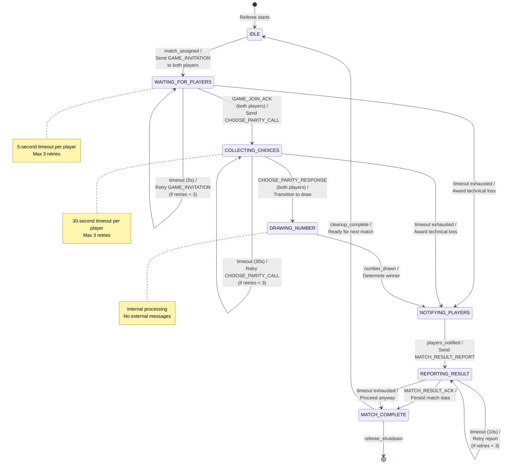
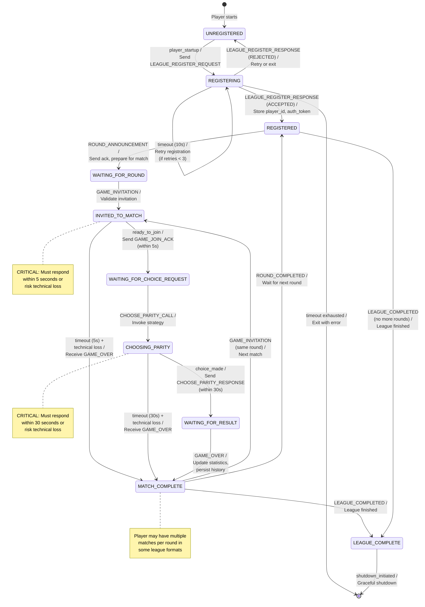

# State Machine Specifications

**Even/Odd League System - Formal State Machine Definitions**

**Document Version:** 1.0
**Last Updated:** 2025-01-19
**Protocol Version:** league.v2

---

## Table of Contents

1. [Overview](#1-overview)
2. [Referee State Machine](#2-referee-state-machine)
3. [Player State Machine](#3-player-state-machine)
4. [Implementation Notes](#4-implementation-notes)

---

## 1. Overview

### 1.1 Purpose

This document provides formal state machine specifications for the Referee and Player agents in the Even/Odd League system. These specifications define:

- All possible states for each agent type
- Valid transitions between states
- Events/messages that trigger transitions
- Actions performed during transitions
- Error handling and timeout behavior
- Illegal transitions and expected responses

### 1.2 Scope

**Covered:**
- Referee state machine (match-level orchestration)
- Player state machine (game participation)

**Not Covered:**
- League Manager state machine (league-level orchestration)
- Network layer state machine
- File system state machine

### 1.3 Notation

**State Names:** UPPERCASE_WITH_UNDERSCORES
**Message Names:** Exact names from mcp_message_contracts.md
**Events:** Internal events shown in lowercase_with_underscores
**Actions:** Described in natural language

---

## 2. Referee State Machine

### 2.1 Overview

The Referee state machine manages the lifecycle of a single match from invitation through result reporting. Each referee instance manages one match at a time.

**Source of Truth:** Referee is the authoritative source for match state.

### 2.2 State List

| # | State Name | Description | Terminal? |
|---|------------|-------------|-----------|
| 1 | IDLE | Referee is idle, waiting for match assignment from round announcement | No |
| 2 | WAITING_FOR_PLAYERS | Sent GAME_INVITATION to both players, waiting for GAME_JOIN_ACK responses | No |
| 3 | COLLECTING_CHOICES | Both players joined, waiting for CHOOSE_PARITY_RESPONSE from both players | No |
| 4 | DRAWING_NUMBER | Internal state: drawing random number and applying game rules to determine winner | No |
| 5 | NOTIFYING_PLAYERS | Sending GAME_OVER notifications to both players | No |
| 6 | REPORTING_RESULT | Sending MATCH_RESULT_REPORT to League Manager | No |
| 7 | MATCH_COMPLETE | Match finished, result reported, ready for next match | Yes (per match) |

**Note:** MATCH_COMPLETE is terminal for a single match, but the referee returns to IDLE for the next match assignment.

### 2.3 Transition Table

#### Transition 1: Match Assignment

| Element | Value |
|---------|-------|
| **Current State** | IDLE |
| **Incoming Event** | match_assigned (internal event triggered by ROUND_ANNOUNCEMENT) |
| **Preconditions** | - Referee is registered<br/>- Referee has available capacity<br/>- Match details provided (match_id, player_A_id, player_B_id, league_id, round_id) |
| **Actions** | 1. Load match context<br/>2. Initialize match state<br/>3. Set match status to WAITING_FOR_PLAYERS<br/>4. Send GAME_INVITATION to Player A<br/>5. Send GAME_INVITATION to Player B<br/>6. Start 5-second timer for each player |
| **Outgoing Messages** | GAME_INVITATION → Player A<br/>GAME_INVITATION → Player B |
| **Next State** | WAITING_FOR_PLAYERS |
| **Timeout** | N/A |
| **Error Handling** | If sending GAME_INVITATION fails:<br/>- Log error<br/>- Retry up to 3 times<br/>- If all retries fail, award technical loss to unreachable player<br/>- Transition to NOTIFYING_PLAYERS with technical loss result |

#### Transition 2a: Player A Arrival (Partial)

| Element | Value |
|---------|-------|
| **Current State** | WAITING_FOR_PLAYERS |
| **Incoming Event** | GAME_JOIN_ACK (from Player A) |
| **Preconditions** | - GAME_JOIN_ACK.match_id matches current match<br/>- GAME_JOIN_ACK.player_id is Player A<br/>- GAME_JOIN_ACK.accept == true<br/>- Received within 5 seconds of GAME_INVITATION<br/>- Player B has NOT yet responded |
| **Actions** | 1. Cancel timeout timer for Player A<br/>2. Mark Player A as arrived<br/>3. Store Player A arrival timestamp |
| **Outgoing Messages** | None |
| **Next State** | WAITING_FOR_PLAYERS (remain in state, waiting for Player B) |
| **Timeout** | N/A (timer already running) |
| **Error Handling** | If GAME_JOIN_ACK.accept == false:<br/>- Award technical loss to Player A<br/>- Award win to Player B<br/>- Transition to NOTIFYING_PLAYERS |

#### Transition 2b: Both Players Arrived

| Element | Value |
|---------|-------|
| **Current State** | WAITING_FOR_PLAYERS |
| **Incoming Event** | GAME_JOIN_ACK (from Player B, completing the pair) |
| **Preconditions** | - GAME_JOIN_ACK.match_id matches current match<br/>- GAME_JOIN_ACK.player_id is Player B<br/>- GAME_JOIN_ACK.accept == true<br/>- Received within 5 seconds of GAME_INVITATION<br/>- Player A has ALREADY responded |
| **Actions** | 1. Cancel timeout timer for Player B<br/>2. Mark Player B as arrived<br/>3. Store Player B arrival timestamp<br/>4. Change match status to COLLECTING_CHOICES<br/>5. Query current standings for both players from League Manager<br/>6. Send CHOOSE_PARITY_CALL to Player A<br/>7. Send CHOOSE_PARITY_CALL to Player B<br/>8. Start 30-second timer for each player |
| **Outgoing Messages** | CHOOSE_PARITY_CALL → Player A<br/>CHOOSE_PARITY_CALL → Player B |
| **Next State** | COLLECTING_CHOICES |
| **Timeout** | N/A (new timers started in next state) |
| **Error Handling** | If GAME_JOIN_ACK.accept == false:<br/>- Award technical loss to Player B<br/>- Award win to Player A<br/>- Transition to NOTIFYING_PLAYERS |

#### Transition 2c: Player A Timeout

| Element | Value |
|---------|-------|
| **Current State** | WAITING_FOR_PLAYERS |
| **Incoming Event** | timeout_player_A (5-second timer expired) |
| **Preconditions** | - Player A has not sent GAME_JOIN_ACK within 5 seconds<br/>- Retry count < max_retries (typically 3) |
| **Actions** | 1. Increment retry_count_A<br/>2. Log timeout event<br/>3. Send GAME_ERROR to Player A (error_code: E001, TIMEOUT_ERROR)<br/>4. Resend GAME_INVITATION to Player A<br/>5. Restart 5-second timer for Player A |
| **Outgoing Messages** | GAME_ERROR → Player A<br/>GAME_INVITATION → Player A |
| **Next State** | WAITING_FOR_PLAYERS (remain in state) |
| **Timeout** | 5 seconds (timer restarted) |
| **Error Handling** | If retry_count_A >= max_retries:<br/>- Award technical loss to Player A<br/>- Award win to Player B (by default)<br/>- Transition to NOTIFYING_PLAYERS with technical loss result |

#### Transition 2d: Player B Timeout

| Element | Value |
|---------|-------|
| **Current State** | WAITING_FOR_PLAYERS |
| **Incoming Event** | timeout_player_B (5-second timer expired) |
| **Preconditions** | - Player B has not sent GAME_JOIN_ACK within 5 seconds<br/>- Retry count < max_retries (typically 3) |
| **Actions** | 1. Increment retry_count_B<br/>2. Log timeout event<br/>3. Send GAME_ERROR to Player B<br/>4. Resend GAME_INVITATION to Player B<br/>5. Restart 5-second timer for Player B |
| **Outgoing Messages** | GAME_ERROR → Player B<br/>GAME_INVITATION → Player B |
| **Next State** | WAITING_FOR_PLAYERS (remain in state) |
| **Timeout** | 5 seconds (timer restarted) |
| **Error Handling** | If retry_count_B >= max_retries:<br/>- Award technical loss to Player B<br/>- Award win to Player A (by default)<br/>- Transition to NOTIFYING_PLAYERS with technical loss result |

#### Transition 3a: Player A Choice Received (Partial)

| Element | Value |
|---------|-------|
| **Current State** | COLLECTING_CHOICES |
| **Incoming Event** | CHOOSE_PARITY_RESPONSE (from Player A) |
| **Preconditions** | - CHOOSE_PARITY_RESPONSE.match_id matches current match<br/>- CHOOSE_PARITY_RESPONSE.player_id is Player A<br/>- CHOOSE_PARITY_RESPONSE.parity_choice is "even" or "odd"<br/>- Received within 30 seconds of CHOOSE_PARITY_CALL<br/>- Player B has NOT yet responded |
| **Actions** | 1. Cancel timeout timer for Player A<br/>2. Store Player A's parity_choice<br/>3. Store Player A choice timestamp |
| **Outgoing Messages** | None |
| **Next State** | COLLECTING_CHOICES (remain in state, waiting for Player B) |
| **Timeout** | N/A (timer already running for Player B) |
| **Error Handling** | If parity_choice is invalid (not "even" or "odd"):<br/>- Send GAME_ERROR to Player A (error_code: E004, INVALID_CHOICE)<br/>- Request Player A to resend choice<br/>- Restart timer if within retry limit<br/>- If retries exhausted, award technical loss to Player A |

#### Transition 3b: Both Choices Received

| Element | Value |
|---------|-------|
| **Current State** | COLLECTING_CHOICES |
| **Incoming Event** | CHOOSE_PARITY_RESPONSE (from Player B, completing the pair) |
| **Preconditions** | - CHOOSE_PARITY_RESPONSE.match_id matches current match<br/>- CHOOSE_PARITY_RESPONSE.player_id is Player B<br/>- CHOOSE_PARITY_RESPONSE.parity_choice is "even" or "odd"<br/>- Received within 30 seconds of CHOOSE_PARITY_CALL<br/>- Player A has ALREADY responded |
| **Actions** | 1. Cancel timeout timer for Player B<br/>2. Store Player B's parity_choice<br/>3. Store Player B choice timestamp<br/>4. Change match status to DRAWING_NUMBER |
| **Outgoing Messages** | None |
| **Next State** | DRAWING_NUMBER |
| **Timeout** | N/A (internal processing state) |
| **Error Handling** | If parity_choice is invalid:<br/>- Send GAME_ERROR to Player B<br/>- Award technical loss to Player B<br/>- Transition to NOTIFYING_PLAYERS |

#### Transition 3c: Player A Choice Timeout

| Element | Value |
|---------|-------|
| **Current State** | COLLECTING_CHOICES |
| **Incoming Event** | timeout_player_A (30-second timer expired) |
| **Preconditions** | - Player A has not sent CHOOSE_PARITY_RESPONSE within 30 seconds<br/>- Retry count < max_retries (typically 3) |
| **Actions** | 1. Increment retry_count_A<br/>2. Log timeout event<br/>3. Send GAME_ERROR to Player A (error_code: E001, TIMEOUT_ERROR, action_required: CHOOSE_PARITY_RESPONSE)<br/>4. Resend CHOOSE_PARITY_CALL to Player A<br/>5. Restart 30-second timer for Player A |
| **Outgoing Messages** | GAME_ERROR → Player A<br/>CHOOSE_PARITY_CALL → Player A |
| **Next State** | COLLECTING_CHOICES (remain in state) |
| **Timeout** | 30 seconds (timer restarted) |
| **Error Handling** | If retry_count_A >= max_retries:<br/>- Award technical loss to Player A<br/>- Award win to Player B (by default)<br/>- Transition to NOTIFYING_PLAYERS with technical loss result |

#### Transition 3d: Player B Choice Timeout

| Element | Value |
|---------|-------|
| **Current State** | COLLECTING_CHOICES |
| **Incoming Event** | timeout_player_B (30-second timer expired) |
| **Preconditions** | - Player B has not sent CHOOSE_PARITY_RESPONSE within 30 seconds<br/>- Retry count < max_retries (typically 3) |
| **Actions** | 1. Increment retry_count_B<br/>2. Log timeout event<br/>3. Send GAME_ERROR to Player B<br/>4. Resend CHOOSE_PARITY_CALL to Player B<br/>5. Restart 30-second timer for Player B |
| **Outgoing Messages** | GAME_ERROR → Player B<br/>CHOOSE_PARITY_CALL → Player B |
| **Next State** | COLLECTING_CHOICES (remain in state) |
| **Timeout** | 30 seconds (timer restarted) |
| **Error Handling** | If retry_count_B >= max_retries:<br/>- Award technical loss to Player B<br/>- Award win to Player A (by default)<br/>- Transition to NOTIFYING_PLAYERS with technical loss result |

#### Transition 4: Number Drawn and Winner Determined

| Element | Value |
|---------|-------|
| **Current State** | DRAWING_NUMBER |
| **Incoming Event** | number_drawn (internal event, automatic) |
| **Preconditions** | - Both players' choices have been stored<br/>- Match state is DRAWING_NUMBER |
| **Actions** | 1. Draw random number from 1-10 (inclusive)<br/>2. Calculate number_parity = "even" if number % 2 == 0 else "odd"<br/>3. Compare Player A choice to number_parity<br/>4. Compare Player B choice to number_parity<br/>5. Determine winner:<br/>   - If both correct or both wrong: status = "DRAW", winner_player_id = null<br/>   - If Player A correct and Player B wrong: status = "WIN", winner_player_id = Player A<br/>   - If Player B correct and Player A wrong: status = "WIN", winner_player_id = Player B<br/>6. Calculate scores:<br/>   - Winner: 3 points<br/>   - Loser: 0 points<br/>   - Draw: 1 point each<br/>7. Generate game_result object<br/>8. Change match status to NOTIFYING_PLAYERS |
| **Outgoing Messages** | None (internal processing) |
| **Next State** | NOTIFYING_PLAYERS |
| **Timeout** | N/A (instant processing) |
| **Error Handling** | If random number generation fails:<br/>- Log critical error<br/>- Retry number generation<br/>- If fails repeatedly, declare match as DRAW (fallback) |

**ASSUMPTION:** Even/Odd game rules are:
- If number is even and player chose "even" → correct
- If number is odd and player chose "odd" → correct
- Both correct → DRAW
- Both wrong → DRAW
- One correct → Winner

#### Transition 5: Notifying Both Players

| Element | Value |
|---------|-------|
| **Current State** | NOTIFYING_PLAYERS |
| **Incoming Event** | ready_to_notify (internal event, automatic) |
| **Preconditions** | - game_result object is complete<br/>- Match status is NOTIFYING_PLAYERS or FINISHED |
| **Actions** | 1. Send GAME_OVER to Player A with complete game_result<br/>2. Send GAME_OVER to Player B with complete game_result<br/>3. Start 10-second timer for acknowledgments (optional)<br/>4. Change match status to REPORTING_RESULT |
| **Outgoing Messages** | GAME_OVER → Player A<br/>GAME_OVER → Player B |
| **Next State** | REPORTING_RESULT |
| **Timeout** | 10 seconds (for acknowledgments, but timeout doesn't block progression) |
| **Error Handling** | If sending GAME_OVER fails:<br/>- Log error<br/>- Retry up to 3 times<br/>- Proceed to REPORTING_RESULT even if player unreachable<br/>- **ASSUMPTION:** Referee proceeds even if players don't acknowledge (best effort notification) |

#### Transition 6: Reporting Result to League Manager

| Element | Value |
|---------|-------|
| **Current State** | REPORTING_RESULT |
| **Incoming Event** | ready_to_report (internal event, automatic) |
| **Preconditions** | - GAME_OVER sent to both players (or timed out)<br/>- Match result is finalized |
| **Actions** | 1. Construct MATCH_RESULT_REPORT message<br/>2. Include winner, scores, drawn_number, choices, status<br/>3. Send MATCH_RESULT_REPORT to League Manager<br/>4. Wait for MATCH_RESULT_ACK or timeout (10 seconds) |
| **Outgoing Messages** | MATCH_RESULT_REPORT → League Manager |
| **Next State** | (waiting for acknowledgment) |
| **Timeout** | 10 seconds |
| **Error Handling** | If MATCH_RESULT_REPORT fails or times out:<br/>- Retry up to 3 times<br/>- Log persistent failure<br/>- Transition to MATCH_COMPLETE anyway (referee cannot block on League Manager) |

#### Transition 7: Match Result Acknowledged

| Element | Value |
|---------|-------|
| **Current State** | REPORTING_RESULT |
| **Incoming Event** | MATCH_RESULT_ACK (from League Manager) |
| **Preconditions** | - MATCH_RESULT_ACK.match_id matches current match<br/>- MATCH_RESULT_ACK.status == "ACCEPTED" |
| **Actions** | 1. Cancel timeout timer<br/>2. Mark match as reported<br/>3. Persist complete match data to `SHARED/data/matches/<league_id>/<match_id>.json`<br/>4. Log match lifecycle transitions<br/>5. Change match status to FINISHED<br/>6. Reset internal state for next match |
| **Outgoing Messages** | None |
| **Next State** | MATCH_COMPLETE |
| **Timeout** | N/A (already acknowledged) |
| **Error Handling** | N/A (successful completion) |

#### Transition 8: Return to Idle

| Element | Value |
|---------|-------|
| **Current State** | MATCH_COMPLETE |
| **Incoming Event** | cleanup_complete (internal event, automatic) |
| **Preconditions** | - Match result has been reported and acknowledged<br/>- All match data persisted |
| **Actions** | 1. Clear match-specific state<br/>2. Mark referee as available<br/>3. Prepare for next match assignment |
| **Outgoing Messages** | None |
| **Next State** | IDLE |
| **Timeout** | N/A |
| **Error Handling** | N/A |

### 2.4 Illegal Transitions

#### In State: IDLE

| Incoming Event/Message | Expected Behavior |
|------------------------|-------------------|
| GAME_JOIN_ACK | Ignore (no active match) |
| CHOOSE_PARITY_RESPONSE | Ignore (no active match) |
| MATCH_RESULT_ACK | Ignore (no active match) |
| Any player message | Log warning, ignore |

#### In State: WAITING_FOR_PLAYERS

| Incoming Event/Message | Expected Behavior |
|------------------------|-------------------|
| CHOOSE_PARITY_RESPONSE | Send GAME_ERROR (error_code: E004, INVALID_STATE), stay in state |
| MATCH_RESULT_ACK | Ignore (not yet reporting) |
| GAME_JOIN_ACK from wrong player | Send GAME_ERROR (error_code: E002, PLAYER_NOT_FOUND), ignore |
| GAME_JOIN_ACK with wrong match_id | Send GAME_ERROR (error_code: E003, MATCH_NOT_FOUND), ignore |
| Duplicate GAME_JOIN_ACK from same player | Ignore duplicate, stay in state |

#### In State: COLLECTING_CHOICES

| Incoming Event/Message | Expected Behavior |
|------------------------|-------------------|
| GAME_JOIN_ACK | Ignore (already joined) |
| MATCH_RESULT_ACK | Ignore (not yet reporting) |
| CHOOSE_PARITY_RESPONSE from wrong player | Send GAME_ERROR, ignore |
| CHOOSE_PARITY_RESPONSE with wrong match_id | Send GAME_ERROR, ignore |
| Duplicate CHOOSE_PARITY_RESPONSE from same player | Use latest choice, warn player |

#### In State: DRAWING_NUMBER

| Incoming Event/Message | Expected Behavior |
|------------------------|-------------------|
| GAME_JOIN_ACK | Ignore (past that phase) |
| CHOOSE_PARITY_RESPONSE | Ignore (already collected) |
| Any external message | Ignore (internal processing state) |

**ASSUMPTION:** DRAWING_NUMBER is a very brief transient state (milliseconds). External messages during this state are queued or ignored.

#### In State: NOTIFYING_PLAYERS

| Incoming Event/Message | Expected Behavior |
|------------------------|-------------------|
| GAME_JOIN_ACK | Ignore (past that phase) |
| CHOOSE_PARITY_RESPONSE | Ignore (already collected) |
| GAME_OVER_ACK | Accept acknowledgment, log, but don't block progression |

#### In State: REPORTING_RESULT

| Incoming Event/Message | Expected Behavior |
|------------------------|-------------------|
| GAME_JOIN_ACK | Ignore (past that phase) |
| CHOOSE_PARITY_RESPONSE | Ignore (already collected) |
| GAME_OVER_ACK | Ignore (already notified) |
| MATCH_RESULT_ACK from wrong match | Log error, ignore |

#### In State: MATCH_COMPLETE

| Incoming Event/Message | Expected Behavior |
|------------------------|-------------------|
| Any message related to completed match | Ignore (match already finished) |
| GAME_JOIN_ACK | Ignore |
| CHOOSE_PARITY_RESPONSE | Ignore |

### 2.5 Timeout Semantics

| State | Timeout Duration | On Timeout | Retry Allowed? | Max Retries |
|-------|------------------|------------|----------------|-------------|
| WAITING_FOR_PLAYERS | 5 seconds per player | Send GAME_ERROR, retry GAME_INVITATION | Yes | 3 |
| COLLECTING_CHOICES | 30 seconds per player | Send GAME_ERROR, retry CHOOSE_PARITY_CALL | Yes | 3 |
| NOTIFYING_PLAYERS | 10 seconds total | Log timeout, proceed to REPORTING_RESULT | No | N/A |
| REPORTING_RESULT | 10 seconds | Retry MATCH_RESULT_REPORT | Yes | 3 |

**ASSUMPTION:** If max retries exhausted for GAME_JOIN_ACK or CHOOSE_PARITY_RESPONSE, referee awards technical loss to non-responding player and proceeds with match completion.

**ASSUMPTION:** Timeout in NOTIFYING_PLAYERS does not block progression. Referee makes best effort to notify players but proceeds to report result regardless.

### 2.6 State Machine Diagram (Mermaid)



---

## 3. Player State Machine

### 3.1 Overview

The Player state machine manages the lifecycle of a player agent from registration through league completion. Each player instance participates in multiple matches across multiple rounds.

**Autonomy:** Player is autonomous in decision-making (strategy) but must respond to protocol messages within timeouts.

### 3.2 State List

| # | State Name | Description | Terminal? |
|---|------------|-------------|-----------|
| 1 | UNREGISTERED | Initial state, player not yet registered with League Manager | No |
| 2 | REGISTERING | Registration request sent, waiting for LEAGUE_REGISTER_RESPONSE | No |
| 3 | REGISTERED | Successfully registered, waiting for first ROUND_ANNOUNCEMENT | No |
| 4 | WAITING_FOR_ROUND | Received ROUND_ANNOUNCEMENT, waiting for GAME_INVITATION from referee | No |
| 5 | INVITED_TO_MATCH | Received GAME_INVITATION, must respond with GAME_JOIN_ACK within 5 seconds | No |
| 6 | WAITING_FOR_CHOICE_REQUEST | Sent GAME_JOIN_ACK, waiting for CHOOSE_PARITY_CALL from referee | No |
| 7 | CHOOSING_PARITY | Received CHOOSE_PARITY_CALL, must send CHOOSE_PARITY_RESPONSE within 30 seconds | No |
| 8 | WAITING_FOR_RESULT | Sent CHOOSE_PARITY_RESPONSE, waiting for GAME_OVER from referee | No |
| 9 | MATCH_COMPLETE | Received GAME_OVER, match finished, waiting for next round or league completion | No |
| 10 | LEAGUE_COMPLETE | Received LEAGUE_COMPLETED, league finished | Yes |

### 3.3 Transition Table

#### Transition 1: Registration Request

| Element | Value |
|---------|-------|
| **Current State** | UNREGISTERED |
| **Incoming Event** | player_startup (internal event, automatic on startup) |
| **Preconditions** | - Player has configuration (display_name, version, game_types, contact_endpoint)<br/>- League Manager is reachable |
| **Actions** | 1. Load player configuration from defaults<br/>2. Construct LEAGUE_REGISTER_REQUEST message<br/>3. Send LEAGUE_REGISTER_REQUEST to League Manager<br/>4. Start 10-second timeout timer |
| **Outgoing Messages** | LEAGUE_REGISTER_REQUEST → League Manager |
| **Next State** | REGISTERING |
| **Timeout** | 10 seconds |
| **Error Handling** | If League Manager unreachable:<br/>- Retry up to 3 times with exponential backoff<br/>- Log error<br/>- If all retries fail, exit with error |

#### Transition 2a: Registration Accepted

| Element | Value |
|---------|-------|
| **Current State** | REGISTERING |
| **Incoming Event** | LEAGUE_REGISTER_RESPONSE (status: ACCEPTED) |
| **Preconditions** | - Received within 10 seconds<br/>- LEAGUE_REGISTER_RESPONSE.status == "ACCEPTED" |
| **Actions** | 1. Cancel timeout timer<br/>2. Store player_id from response<br/>3. Store auth_token from response<br/>4. Store league_id from response<br/>5. Log successful registration<br/>6. Mark state as REGISTERED |
| **Outgoing Messages** | None |
| **Next State** | REGISTERED |
| **Timeout** | N/A (already received response) |
| **Error Handling** | N/A (successful registration) |

#### Transition 2b: Registration Rejected

| Element | Value |
|---------|-------|
| **Current State** | REGISTERING |
| **Incoming Event** | LEAGUE_REGISTER_RESPONSE (status: REJECTED) |
| **Preconditions** | - Received within 10 seconds<br/>- LEAGUE_REGISTER_RESPONSE.status == "REJECTED" |
| **Actions** | 1. Cancel timeout timer<br/>2. Log rejection reason<br/>3. Alert user or retry with modified parameters (e.g., different display_name)<br/>4. If retryable error, return to UNREGISTERED and retry<br/>5. If non-retryable error, exit with error |
| **Outgoing Messages** | None (or retry LEAGUE_REGISTER_REQUEST) |
| **Next State** | UNREGISTERED (if retrying) or exit |
| **Timeout** | N/A |
| **Error Handling** | If reason is "Duplicate name":<br/>- Append random suffix to display_name<br/>- Return to UNREGISTERED and retry<br/>If reason is "League full":<br/>- Exit with error (cannot proceed) |

#### Transition 2c: Registration Timeout

| Element | Value |
|---------|-------|
| **Current State** | REGISTERING |
| **Incoming Event** | timeout (10 seconds elapsed) |
| **Preconditions** | - No LEAGUE_REGISTER_RESPONSE received within 10 seconds |
| **Actions** | 1. Log timeout<br/>2. Retry LEAGUE_REGISTER_REQUEST (if retries < 3)<br/>3. Restart 10-second timer |
| **Outgoing Messages** | LEAGUE_REGISTER_REQUEST → League Manager (retry) |
| **Next State** | REGISTERING (remain in state) |
| **Timeout** | 10 seconds (timer restarted) |
| **Error Handling** | If retries >= 3:<br/>- Exit with error "Failed to register with League Manager" |

#### Transition 3: Round Announcement Received

| Element | Value |
|---------|-------|
| **Current State** | REGISTERED or MATCH_COMPLETE |
| **Incoming Event** | ROUND_ANNOUNCEMENT |
| **Preconditions** | - Player is registered<br/>- ROUND_ANNOUNCEMENT.league_id matches player's league<br/>- Player appears in one of the matches |
| **Actions** | 1. Parse ROUND_ANNOUNCEMENT message<br/>2. Extract round_id<br/>3. Find match(es) where player is participant<br/>4. Store match context (match_id, opponent_id, referee_endpoint)<br/>5. Send acknowledgment to League Manager<br/>6. Prepare to receive GAME_INVITATION from referee |
| **Outgoing Messages** | ROUND_ANNOUNCEMENT_ACK → League Manager |
| **Next State** | WAITING_FOR_ROUND |
| **Timeout** | 10 seconds (for acknowledgment) |
| **Error Handling** | If player not found in any match:<br/>- Log warning (player might be sitting out this round)<br/>- Stay in REGISTERED state<br/>- Wait for next ROUND_ANNOUNCEMENT |

#### Transition 4: Game Invitation Received

| Element | Value |
|---------|-------|
| **Current State** | WAITING_FOR_ROUND |
| **Incoming Event** | GAME_INVITATION |
| **Preconditions** | - GAME_INVITATION.match_id matches expected match<br/>- GAME_INVITATION.league_id matches player's league<br/>- GAME_INVITATION from expected referee_endpoint |
| **Actions** | 1. Parse GAME_INVITATION message<br/>2. Validate match_id, league_id, opponent_id<br/>3. Store role_in_match (PLAYER_A or PLAYER_B)<br/>4. Store referee sender for future messages<br/>5. Start internal 5-second countdown |
| **Outgoing Messages** | None (must respond within 5 seconds) |
| **Next State** | INVITED_TO_MATCH |
| **Timeout** | 5 seconds (player MUST send GAME_JOIN_ACK within this time) |
| **Error Handling** | If invitation validation fails (wrong match_id, etc.):<br/>- Log error<br/>- Send error response to referee<br/>- Stay in WAITING_FOR_ROUND |

#### Transition 5: Join Acknowledgment Sent

| Element | Value |
|---------|-------|
| **Current State** | INVITED_TO_MATCH |
| **Incoming Event** | ready_to_join (internal event, typically immediate) |
| **Preconditions** | - GAME_INVITATION has been validated<br/>- Player decides to accept (accept = true)<br/>- Still within 5-second window |
| **Actions** | 1. Construct GAME_JOIN_ACK message<br/>2. Set accept = true<br/>3. Set arrival_timestamp = current UTC time<br/>4. Send GAME_JOIN_ACK to referee<br/>5. Log join confirmation |
| **Outgoing Messages** | GAME_JOIN_ACK → Referee |
| **Next State** | WAITING_FOR_CHOICE_REQUEST |
| **Timeout** | N/A (waiting for referee to send CHOOSE_PARITY_CALL) |
| **Error Handling** | If sending GAME_JOIN_ACK fails:<br/>- Retry immediately<br/>- If still within 5-second window, retry up to 3 times<br/>- If window expires, player will receive technical loss |

**ASSUMPTION:** Player always accepts invitations (accept = true). Declining (accept = false) would result in immediate technical loss.

#### Transition 5b: Join Timeout (Player Missed Deadline)

| Element | Value |
|---------|-------|
| **Current State** | INVITED_TO_MATCH |
| **Incoming Event** | timeout (5 seconds elapsed without sending GAME_JOIN_ACK) |
| **Preconditions** | - Player failed to send GAME_JOIN_ACK within 5 seconds<br/>- Referee may send GAME_ERROR and retry |
| **Actions** | 1. Log timeout error<br/>2. Attempt to send GAME_JOIN_ACK immediately (may be late)<br/>3. If GAME_ERROR received, prepare to respond to retry |
| **Outgoing Messages** | GAME_JOIN_ACK → Referee (late, may be rejected) |
| **Next State** | INVITED_TO_MATCH (if referee retries) or MATCH_COMPLETE (if technical loss awarded) |
| **Timeout** | N/A |
| **Error Handling** | If referee awards technical loss:<br/>- Receive GAME_OVER with status: TECHNICAL_LOSS<br/>- Transition to MATCH_COMPLETE<br/>- Update loss count |

#### Transition 6: Choice Request Received

| Element | Value |
|---------|-------|
| **Current State** | WAITING_FOR_CHOICE_REQUEST |
| **Incoming Event** | CHOOSE_PARITY_CALL |
| **Preconditions** | - CHOOSE_PARITY_CALL.match_id matches current match<br/>- CHOOSE_PARITY_CALL.player_id matches player's ID<br/>- Received from correct referee |
| **Actions** | 1. Parse CHOOSE_PARITY_CALL message<br/>2. Extract context (opponent_id, current standings, deadline)<br/>3. Start internal 30-second countdown<br/>4. Invoke strategy module to decide parity choice |
| **Outgoing Messages** | None (must respond within 30 seconds) |
| **Next State** | CHOOSING_PARITY |
| **Timeout** | 30 seconds (player MUST send CHOOSE_PARITY_RESPONSE within this time) |
| **Error Handling** | If message validation fails:<br/>- Log error<br/>- Request clarification from referee (send error)<br/>- May result in timeout if not resolved |

#### Transition 7: Parity Choice Made and Sent

| Element | Value |
|---------|-------|
| **Current State** | CHOOSING_PARITY |
| **Incoming Event** | choice_made (internal event from strategy module) |
| **Preconditions** | - Strategy module has decided on "even" or "odd"<br/>- Still within 30-second window<br/>- Decision is valid ("even" or "odd") |
| **Actions** | 1. Receive parity_choice from strategy module<br/>2. Validate parity_choice is "even" or "odd"<br/>3. Construct CHOOSE_PARITY_RESPONSE message<br/>4. Send CHOOSE_PARITY_RESPONSE to referee<br/>5. Log decision (for learning/analysis)<br/>6. Stop internal countdown |
| **Outgoing Messages** | CHOOSE_PARITY_RESPONSE → Referee |
| **Next State** | WAITING_FOR_RESULT |
| **Timeout** | N/A (waiting for GAME_OVER from referee) |
| **Error Handling** | If sending CHOOSE_PARITY_RESPONSE fails:<br/>- Retry immediately<br/>- If still within 30-second window, retry up to 3 times<br/>- If window expires, player will receive technical loss |

#### Transition 7b: Choice Timeout (Player Missed Deadline)

| Element | Value |
|---------|-------|
| **Current State** | CHOOSING_PARITY |
| **Incoming Event** | timeout (30 seconds elapsed without sending CHOOSE_PARITY_RESPONSE) |
| **Preconditions** | - Player failed to send CHOOSE_PARITY_RESPONSE within 30 seconds<br/>- Strategy module took too long or crashed |
| **Actions** | 1. Log critical timeout error<br/>2. Attempt to send CHOOSE_PARITY_RESPONSE immediately with fallback choice (e.g., "even")<br/>3. If GAME_ERROR received, prepare to respond to retry |
| **Outgoing Messages** | CHOOSE_PARITY_RESPONSE → Referee (late, may be rejected) |
| **Next State** | CHOOSING_PARITY (if referee retries) or MATCH_COMPLETE (if technical loss awarded) |
| **Timeout** | N/A |
| **Error Handling** | If referee awards technical loss:<br/>- Receive GAME_OVER with status: TECHNICAL_LOSS<br/>- Transition to MATCH_COMPLETE<br/>- Update loss count<br/>- Log strategy module failure |

**ASSUMPTION:** If strategy module fails to return choice within 30 seconds, player sends fallback choice ("even") to attempt to avoid technical loss.

#### Transition 8: Game Result Received

| Element | Value |
|---------|-------|
| **Current State** | WAITING_FOR_RESULT |
| **Incoming Event** | GAME_OVER |
| **Preconditions** | - GAME_OVER.match_id matches current match<br/>- GAME_OVER from correct referee |
| **Actions** | 1. Parse GAME_OVER message<br/>2. Extract game_result (status, winner, drawn_number, number_parity, choices, reason)<br/>3. Determine if player won, lost, or drew<br/>4. Update internal statistics:<br/>   - If winner_player_id == player_id: wins++<br/>   - If status == DRAW: draws++<br/>   - If winner_player_id != player_id: losses++<br/>   - Update points based on scoring (win=3, draw=1, loss=0)<br/>5. Store match result in personal history<br/>6. Persist history to `SHARED/data/players/<player_id>/history.json`<br/>7. Send acknowledgment to referee (within 10 seconds)<br/>8. Log match outcome for strategy learning (optional) |
| **Outgoing Messages** | GAME_OVER_ACK → Referee |
| **Next State** | MATCH_COMPLETE |
| **Timeout** | 10 seconds (for acknowledgment) |
| **Error Handling** | If game_result parsing fails:<br/>- Log error<br/>- Still acknowledge receipt<br/>- Mark match as completed but flag as data error |

#### Transition 9a: Round Continues (Next Match)

| Element | Value |
|---------|-------|
| **Current State** | MATCH_COMPLETE |
| **Incoming Event** | GAME_INVITATION (for another match in same round) |
| **Preconditions** | - Current round has multiple matches<br/>- Player is scheduled for another match in same round<br/>- GAME_INVITATION.round_id matches current round |
| **Actions** | 1. Same as Transition 4 (Game Invitation Received) |
| **Outgoing Messages** | None initially |
| **Next State** | INVITED_TO_MATCH |
| **Timeout** | 5 seconds |
| **Error Handling** | Same as Transition 4 |

**ASSUMPTION:** In standard Round-Robin with 4 players, each player plays once per round, so this transition is rare. However, in larger leagues or different formats, a player might have multiple matches per round.

#### Transition 9b: Round Completed

| Element | Value |
|---------|-------|
| **Current State** | MATCH_COMPLETE |
| **Incoming Event** | LEAGUE_STANDINGS_UPDATE followed by ROUND_COMPLETED |
| **Preconditions** | - All matches in round complete<br/>- League Manager has calculated standings |
| **Actions** | 1. Receive LEAGUE_STANDINGS_UPDATE:<br/>   - Parse standings array<br/>   - Find player's rank and statistics<br/>   - Update internal standings cache<br/>   - Send acknowledgment<br/>2. Receive ROUND_COMPLETED:<br/>   - Parse round_id, next_round_id<br/>   - Send acknowledgment<br/>3. If next_round_id is not null:<br/>   - Prepare for next round<br/>4. If next_round_id is null:<br/>   - Expect LEAGUE_COMPLETED |
| **Outgoing Messages** | STANDINGS_UPDATE_ACK → League Manager<br/>ROUND_COMPLETED_ACK → League Manager |
| **Next State** | REGISTERED (waiting for next ROUND_ANNOUNCEMENT) |
| **Timeout** | 10 seconds (per acknowledgment) |
| **Error Handling** | If acknowledgment fails:<br/>- Retry up to 3 times<br/>- Proceed even if League Manager doesn't receive ack |

#### Transition 10: League Completed

| Element | Value |
|---------|-------|
| **Current State** | MATCH_COMPLETE or REGISTERED |
| **Incoming Event** | LEAGUE_COMPLETED |
| **Preconditions** | - All rounds complete<br/>- LEAGUE_COMPLETED.league_id matches player's league |
| **Actions** | 1. Parse LEAGUE_COMPLETED message<br/>2. Extract final_standings and champion information<br/>3. Log player's final rank and statistics<br/>4. Send acknowledgment to League Manager<br/>5. Persist final statistics<br/>6. Optionally display summary to user<br/>7. Mark league as complete |
| **Outgoing Messages** | LEAGUE_COMPLETED_ACK → League Manager |
| **Next State** | LEAGUE_COMPLETE |
| **Timeout** | 10 seconds (for acknowledgment) |
| **Error Handling** | If acknowledgment fails:<br/>- Retry once<br/>- Proceed to graceful shutdown regardless |

#### Transition 11: Graceful Shutdown

| Element | Value |
|---------|-------|
| **Current State** | LEAGUE_COMPLETE |
| **Incoming Event** | shutdown_initiated (internal event or external signal) |
| **Preconditions** | - League is complete<br/>- All data persisted |
| **Actions** | 1. Close HTTP server<br/>2. Close file handles<br/>3. Log final statistics<br/>4. Exit gracefully |
| **Outgoing Messages** | None |
| **Next State** | [*] (terminal, process exits) |
| **Timeout** | N/A |
| **Error Handling** | N/A |

### 3.4 Illegal Transitions

#### In State: UNREGISTERED

| Incoming Event/Message | Expected Behavior |
|------------------------|-------------------|
| ROUND_ANNOUNCEMENT | Ignore (not registered) |
| GAME_INVITATION | Ignore (not registered) |
| CHOOSE_PARITY_CALL | Ignore (not registered) |
| GAME_OVER | Ignore (not registered) |
| Any league message | Log error, remain UNREGISTERED |

#### In State: REGISTERING

| Incoming Event/Message | Expected Behavior |
|------------------------|-------------------|
| ROUND_ANNOUNCEMENT | Queue for later (should not arrive before registration complete) |
| GAME_INVITATION | Ignore (registration not complete) |
| Duplicate LEAGUE_REGISTER_RESPONSE | Use first response, ignore duplicate |

#### In State: REGISTERED

| Incoming Event/Message | Expected Behavior |
|------------------------|-------------------|
| GAME_INVITATION | Ignore if not preceded by ROUND_ANNOUNCEMENT with matching round_id |
| CHOOSE_PARITY_CALL | Ignore (not yet invited to match) |
| GAME_OVER | Ignore (not in match) |
| LEAGUE_REGISTER_RESPONSE | Ignore (already registered) |

#### In State: WAITING_FOR_ROUND

| Incoming Event/Message | Expected Behavior |
|------------------------|-------------------|
| CHOOSE_PARITY_CALL | Ignore (not yet joined match) |
| GAME_OVER | Ignore (not in match) |
| ROUND_ANNOUNCEMENT for different round | Accept (new round starting) |
| GAME_INVITATION with wrong match_id | Reject, send error |

#### In State: INVITED_TO_MATCH

| Incoming Event/Message | Expected Behavior |
|------------------------|-------------------|
| CHOOSE_PARITY_CALL | Ignore (must send GAME_JOIN_ACK first) |
| GAME_OVER | Accept (referee may have awarded technical loss to opponent, match over early) |
| Duplicate GAME_INVITATION | Ignore duplicate |
| ROUND_ANNOUNCEMENT | Queue (should not arrive during match) |

#### In State: WAITING_FOR_CHOICE_REQUEST

| Incoming Event/Message | Expected Behavior |
|------------------------|-------------------|
| GAME_INVITATION | Ignore (already in match) |
| GAME_OVER | Accept (referee may have awarded technical loss to opponent, match over early) |
| ROUND_ANNOUNCEMENT | Queue (should not arrive during match) |

#### In State: CHOOSING_PARITY

| Incoming Event/Message | Expected Behavior |
|------------------------|-------------------|
| GAME_INVITATION | Ignore (already in match) |
| Duplicate CHOOSE_PARITY_CALL | Ignore duplicate, continue with current choice |
| GAME_OVER before sending choice | Accept (opponent may have timed out, match over early) |

#### In State: WAITING_FOR_RESULT

| Incoming Event/Message | Expected Behavior |
|------------------------|-------------------|
| GAME_INVITATION | Ignore (already in match) |
| CHOOSE_PARITY_CALL | Ignore (already sent choice) |
| Duplicate GAME_OVER | Use first result, ignore duplicate |

#### In State: MATCH_COMPLETE

| Incoming Event/Message | Expected Behavior |
|------------------------|-------------------|
| Messages for completed match | Ignore (match already finished) |
| GAME_INVITATION for new match | Accept (next match starting) |
| ROUND_ANNOUNCEMENT | Accept (next round starting) |

#### In State: LEAGUE_COMPLETE

| Incoming Event/Message | Expected Behavior |
|------------------------|-------------------|
| Any game-related message | Ignore (league finished) |
| LEAGUE_COMPLETED | Ignore duplicate |
| ROUND_ANNOUNCEMENT | Ignore (league finished) |

### 3.5 Timeout Semantics

| State | Timeout Duration | On Timeout | Action Taken |
|-------|------------------|------------|--------------|
| REGISTERING | 10 seconds | Retry LEAGUE_REGISTER_REQUEST | Retry up to 3 times, then exit |
| INVITED_TO_MATCH | 5 seconds | Must send GAME_JOIN_ACK | Player risks technical loss if exceeds |
| CHOOSING_PARITY | 30 seconds | Must send CHOOSE_PARITY_RESPONSE | Player risks technical loss if exceeds |
| All acknowledgments | 10 seconds | Send acknowledgment | Retry up to 3 times, but doesn't block player |

**Critical Timeouts (Player MUST meet):**
- **5 seconds** for GAME_JOIN_ACK: If exceeded, referee may retry or award technical loss
- **30 seconds** for CHOOSE_PARITY_RESPONSE: If exceeded, referee may retry or award technical loss

**Non-Critical Timeouts (Best Effort):**
- **10 seconds** for acknowledgments (ROUND_ANNOUNCEMENT_ACK, STANDINGS_UPDATE_ACK, etc.): Player should send within 10 seconds, but timeout doesn't result in technical loss

### 3.6 State Machine Diagram (Mermaid)



---

## 4. Implementation Notes

### 4.1 State Machine Enforcement

**Recommended Implementation Pattern:**

```python
# Pseudocode example (NOT actual implementation)

class RefereeStateMachine:
    def __init__(self):
        self.current_state = State.IDLE
        self.match_context = {}
        self.timers = {}

    def handle_event(self, event, data=None):
        # Validate transition is legal
        if not self.is_transition_valid(self.current_state, event):
            self.handle_illegal_transition(event)
            return

        # Execute transition
        transition = self.get_transition(self.current_state, event)
        transition.execute(data)

        # Update state
        self.current_state = transition.next_state

    def is_transition_valid(self, state, event):
        # Check transition table
        return (state, event) in self.transition_table

    def handle_illegal_transition(self, event):
        # Log warning, send error response if needed
        # Refer to "Illegal Transitions" section
        pass
```

**Key Implementation Considerations:**

1. **Explicit State Storage:**
   - Store current_state as an enum or constant
   - Persist state to disk for crash recovery (optional)
   - Log all state transitions

2. **Transition Guards:**
   - Check preconditions before executing transition
   - If preconditions fail, stay in current state and handle error

3. **Action Execution:**
   - Execute all actions atomically during transition
   - If action fails, implement rollback or error recovery
   - Log all actions for debugging

4. **Timeout Management:**
   - Use timer/scheduler for timeout events
   - Cancel timers when transition occurs early
   - Handle timeout as regular event in state machine

5. **Error Handling:**
   - Illegal transitions → Log warning, ignore or send error response
   - Timeout → Retry or transition to error state
   - Critical failures → Award technical loss or abort match

6. **Testing:**
   - Unit test each transition individually
   - Integration test complete flows
   - Test timeout behavior with mocked timers
   - Test illegal transition handling

### 4.2 State Persistence (Optional but Recommended)

For crash recovery, consider persisting state machine state:

```yaml
# Example state snapshot
referee_state:
  current_state: WAITING_FOR_PLAYERS
  match_id: R1M1
  player_A_id: P01
  player_B_id: P02
  player_A_arrived: true
  player_B_arrived: false
  retry_count_A: 0
  retry_count_B: 1
  timestamp: "2025-01-19T10:01:05Z"
```

On restart, referee can:
- Resume from last known state
- Retry pending operations
- Award technical losses if timeouts exhausted

### 4.3 Timeout Implementation

**Use a Timer/Scheduler Library:**

```python
# Pseudocode example
class TimeoutManager:
    def set_timeout(self, duration_seconds, callback):
        timer_id = self.scheduler.enter(duration_seconds, 1, callback)
        return timer_id

    def cancel_timeout(self, timer_id):
        self.scheduler.cancel(timer_id)

# Usage in referee
timer_id = timeout_manager.set_timeout(5, lambda: self.handle_timeout('player_A'))
# ... wait for GAME_JOIN_ACK ...
timeout_manager.cancel_timeout(timer_id)  # Cancel if response received
```

**Timeout Events as First-Class Events:**
- Timeout should trigger state machine event (e.g., `timeout_player_A`)
- Timeout handling follows same pattern as message handling
- Enables consistent testing and logging

### 4.4 Concurrency Considerations

**Referee:**
- Typically manages one match at a time (sequential)
- If managing multiple matches concurrently, use separate state machine instances per match
- Use thread-safe data structures for shared state

**Player:**
- Typically in one match at a time
- Use locks or async/await to prevent race conditions
- Ensure strategy module doesn't block state transitions

### 4.5 Logging and Debugging

**Log Every State Transition:**
```
[2025-01-19T10:01:00Z] [REF01] [R1M1] State transition: IDLE -> WAITING_FOR_PLAYERS (event: match_assigned)
[2025-01-19T10:01:01Z] [REF01] [R1M1] Sent GAME_INVITATION to P01
[2025-01-19T10:01:01Z] [REF01] [R1M1] Sent GAME_INVITATION to P02
[2025-01-19T10:01:02Z] [REF01] [R1M1] Received GAME_JOIN_ACK from P01 (accept=true)
[2025-01-19T10:01:03Z] [REF01] [R1M1] Received GAME_JOIN_ACK from P02 (accept=true)
[2025-01-19T10:01:03Z] [REF01] [R1M1] State transition: WAITING_FOR_PLAYERS -> COLLECTING_CHOICES (event: both_players_arrived)
```

**Benefits:**
- Easy to trace message flow
- Easy to diagnose timeout issues
- Easy to replay scenarios for testing

### 4.6 State Machine Validation

**Pre-Deployment Validation:**
1. Generate all possible state transition paths
2. Verify no deadlocks (unreachable terminal states)
3. Verify all timeout paths lead to resolution (no infinite retry loops)
4. Verify all error conditions are handled
5. Use state machine visualization tools to review diagrams

**Runtime Validation:**
1. Assert current state matches expected state before transitions
2. Log warnings for unexpected events
3. Monitor state machine health metrics (time spent in each state)

### 4.7 Comparison: Referee vs Player State Machines

| Aspect | Referee | Player |
|--------|---------|--------|
| **Complexity** | Moderate (7 states) | High (10 states) |
| **Critical Timeouts** | 5s, 30s (enforces on players) | 5s, 30s (must meet) |
| **Error Recovery** | Retry + technical loss | Retry + accept technical loss |
| **Concurrency** | Typically sequential (one match) | Typically sequential (one match) |
| **Autonomy** | Orchestrates match flow | Autonomous strategy decisions |
| **State Persistence** | Recommended for crash recovery | Optional (less critical) |
| **Terminal States** | MATCH_COMPLETE (per match) | LEAGUE_COMPLETE (final) |

---

**Document Status:** Complete State Machine Specifications
**Coverage:** Referee and Player state machines fully documented
**Ready For:** Implementation and testing

**Mermaid Diagrams:** Render correctly in GitHub Markdown

**Implementation Checklist:**
- [ ] Implement state enums for Referee and Player
- [ ] Implement transition tables
- [ ] Implement timeout management
- [ ] Implement illegal transition handling
- [ ] Add state transition logging
- [ ] Unit test each transition
- [ ] Integration test complete flows
- [ ] Test timeout scenarios
- [ ] Test error recovery
- [ ] Validate state machine diagrams render correctly
